# Agentic Wiki — 项目架构导航

> 个人知识管理 Web 应用：由 LLM 从原始资料（Markdown / HTML / PDF / 纯文本）增量构建并维护一个可持久化、相互交叉引用的 Wiki 系统。

---

## 一、项目愿景

- **目标**：将"读到的任何东西"通过 LLM 代理自动组织成一个带 wikilink 的知识网络。
- **核心工作流**：读资料 → LLM 规划变更 → 校验 → 写入 vault → Drizzle/SQLite 索引 → git 提交（Saga 事务）。
- **UX 原型**："The Triad" 三联布局：左导航树 / 中央阅读或对话区 / 右侧上下文面板（反向链接、元数据、迷你图）。
- **多主题（Subject）**：知识库按 **Subject** 划分独立工作区（`general` / `<custom>`），同名 slug 在不同 subject 中互不污染；跨主题用 `[[other-subject:Page]]` 显式引用。
- **部署**：Next.js 15（App Router）全栈 + 独立 worker 进程 + 共享 vault/SQLite 数据卷。

---

## 二、技术栈

| 分类 | 选型 |
|------|------|
| 框架 | Next.js 15 (App Router) + React 19 + TypeScript 5 |
| 样式 | Tailwind CSS 3.4 + class-variance-authority + 自定义 CSS 变量主题 |
| 状态 | Zustand（客户端 UI 状态，含持久化迁移 v1→v4）+ TanStack React Query |
| 数据库 | better-sqlite3 11 + Drizzle ORM 0.38 + FTS5 全文检索 + 向量语义检索（page_embeddings BLOB + JS cosine） |
| LLM | Vercel AI SDK 4 + 多供应商（Anthropic / OpenAI / Google / DeepSeek / Mistral / xAI / Ollama / OpenAI-compatible）|
| Markdown | unified / remark / rehype + gray-matter（frontmatter）+ rehype-pretty-code（Shiki 高亮）+ @uiw/react-md-editor |
| 其它 | simple-git（Vault git 提交）、pdf-parse、turndown（HTML → MD）、cytoscape（图可视化）、zod（Schema）|

---

## 三、架构总览

### 进程与职责分离

```
┌──────────────────────────┐        ┌────────────────────────────┐
│ Next.js (Web / API)      │        │ Worker Process (tsx)        │
│ ──────────────────────   │        │ ──────────────────────────  │
│ · App Router 页面        │        │ · 从 jobs 表拉取任务        │
│ · /api/* Route Handlers  │──enq──▶│ · 多阶段 LLM 调用           │
│ · 仅做入队与读操作       │        │ · 写 vault + SQLite + git   │
└──────────┬───────────────┘        └──────────┬──────────────────┘
           │                                   │
           │     ┌──────────────── 共享卷 ──────────┼─────────────┐
           └────▶│ vault/  (git repo)               │  wiki.db    │◀────┘
                 │ ├── wiki/<subject>/*.md          │  SQLite +   │
                 │ ├── raw/<subject>/...            │  FTS5       │
                 │ └── .llm-wiki/sources/<subject>/ │             │
                 └──────────────────────────────────┴─────────────┘
```

### 关键架构决策

| 决策 | 选择 | 理由 |
|------|------|------|
| 长任务执行 | 独立 worker 进程（`src/server/worker-entry.ts`）| Route Handler 生命周期不可靠；worker 提供清晰的任务管理 |
| Wiki 写入 | Saga 事务模式：内存 changeset → validate → fs → SQLite tx → git commit | fs + SQLite + git 无法组成真正的 ACID；需要可恢复的补偿流 |
| LLM 产出 | `generateObject()` + Zod schema + 本地序列化 | 防止跨供应商格式漂移 |
| Wikilink 解析 | 单一 `resolveWikiLinkTarget()`（`src/server/wiki/wikilinks.ts`）| 避免前端/indexer/lint/LLM 校验多份实现语义漂移 |
| 并发控制 | `vault-mutex.ts` + worker 的 Ingest 有界并发/非 Ingest 独占 + SQLite WAL | Ingest 可并发处理，所有 vault 写入仍由进程内队列和跨进程文件锁串行保护 |
| 源数据 | `vault/.llm-wiki/sources/<subject>/*.json` 同时落地 | SQLite 仅作为可重建缓存 |
| Subject 隔离 | first-class `subjects` 表 + `pages` 复合 PK `(subject_id, slug)` + `path UNIQUE` | 跨主题同名 slug 合法；fs 路径仍唯一；删除 subject 级联清理全部关联数据（DB 单事务 + vault 目录 + git commit），`general`/active/被跨主题引用者禁删 |
| Subject 解析 | `src/server/middleware/subject.ts::resolveSubjectFromRequest()`（`?subjectId` > `?s=` > body > cookie `wiki_subject` > general 兜底）| 服务端唯一真实源；前端通过 store + cookie 同步 |

### 模块结构图

```mermaid
graph TD
    Root["(根) agentic-wiki"] --> App["src/app<br/>Next.js App Router"]
    Root --> Server["src/server<br/>后端业务逻辑"]
    Root --> Components["src/components<br/>React UI 组件"]
    Root --> Lib["src/lib<br/>共享工具"]
    Root --> Hooks["src/hooks<br/>React Hooks"]
    Root --> Stores["src/stores<br/>Zustand 客户端状态"]

    App --> AppApi["api/<br/>Route Handlers"]
    App --> AppRoutes["(app)/<br/>页面路由"]

    Server --> SrvDb["db/<br/>Drizzle + repos"]
    Server --> SrvWiki["wiki/<br/>Saga 事务核心"]
    Server --> SrvJobs["jobs/<br/>任务队列"]
    Server --> SrvLlm["llm/<br/>多供应商路由"]
    Server --> SrvSrc["sources/<br/>原始文档解析"]
    Server --> SrvSvc["services/<br/>任务处理器"]
    Server --> SrvGit["git/<br/>vault 版本控制"]
    Server --> SrvMw["middleware/<br/>鉴权+CSRF"]
    Server --> SrvCfg["config/<br/>env 与路径"]

    Components --> CompLayout["layout/<br/>Shell/Header/Sidebar/ContextPanel"]
    Components --> CompUi["ui/<br/>设计系统原语"]
    Components --> CompWiki["wiki/<br/>页面渲染"]
    Components --> CompChat["chat/<br/>对话 UI"]
    Components --> CompSearch["search/<br/>命令面板"]
    Components --> CompGraph["graph/<br/>图可视化"]
    Components --> CompShared["shared/<br/>全局组件"]

    click App "./src/app/CLAUDE.md" "查看 App 模块文档"
    click Server "./src/server/CLAUDE.md" "查看 Server 模块文档"
    click Components "./src/components/CLAUDE.md" "查看 Components 模块文档"
    click Lib "./src/lib/CLAUDE.md" "查看 Lib 模块文档"
    click SrvDb "./src/server/db/CLAUDE.md" "查看 DB 子模块文档"
    click SrvWiki "./src/server/wiki/CLAUDE.md" "查看 Wiki 子模块文档"
    click SrvJobs "./src/server/jobs/CLAUDE.md" "查看 Jobs 子模块文档"
    click SrvLlm "./src/server/llm/CLAUDE.md" "查看 LLM 子模块文档"
    click SrvSvc "./src/server/services/CLAUDE.md" "查看 Services 子模块文档"
    click SrvSrc "./src/server/sources/CLAUDE.md" "查看 Sources 子模块文档"
```



---

## 四、模块索引

| 路径 | 一句话职责 | 文档链接 |
|------|------------|----------|
| `src/app/` | Next.js App Router，包含页面（含 `(app)/subjects` 管理页）与 `/api/*` Route Handlers（含 `/api/subjects`） | [查看](./src/app/CLAUDE.md) |
| `src/server/` | 所有后端业务代码（"server-only"），分层为数据/事务/任务/LLM/服务/中间件 | [查看](./src/server/CLAUDE.md) |
| `src/server/agents/` | Ingest multi-agent runtime + 全 runner 共用的 17 个 builtin tool、8 个 ToolProfile 与执行策略 | [查看](./src/server/agents/CLAUDE.md) |
| `src/server/db/` | Drizzle schema、SQLite 单例、subjects/pages/jobs/sources/embeddings repos + FTS5 | [查看](./src/server/db/CLAUDE.md) |
| `src/server/wiki/` | Saga 事务核心 + page plan/apply + metadata/link 窄写内核（subject-aware） | [查看](./src/server/wiki/CLAUDE.md) |
| `src/server/search/` | 向量语义检索：vector-math / semantic-search / hybrid-retrieval（⑧） | N/A |
| `src/server/jobs/` | 任务队列（SQLite 持久化）+ worker 轮询 + SSE 事件发射 | [查看](./src/server/jobs/CLAUDE.md) |
| `src/server/llm/` | 多供应商路由、task-router（defaults < task < override）、结构化输出、向量嵌入（⑧） | [查看](./src/server/llm/CLAUDE.md) |
| `src/server/services/` | 任务/工作流编排：ingest/query/lint/fix/curate/research/re-enrich/embedding + PendingAction/Research 审批与 provenance 对账（强制 subjectId） | [查看](./src/server/services/CLAUDE.md) |
| `src/server/sources/` | 原始文档解析器（md/html/pdf）+ source-store + SSRF-safe URL 抓取（subject-scoped 持久化） | [查看](./src/server/sources/CLAUDE.md) |
| `src/server/git/` | vault 仓库初始化、commit、restoreToHead（用于 Saga 回滚）| `src/server/git/git-service.ts` |
| `src/server/middleware/` | `requireAuth` + `requireCsrf` + `resolveSubjectFromRequest`（subject 解析单一真实源）| `src/server/middleware/{auth,subject}.ts` |
| `src/server/config/` | env schema（zod）+ `vaultPath()` 辅助 | `src/server/config/env.ts` |
| `src/components/` | React UI 组件（布局 / 设计系统 / wiki 渲染 / chat / search / graph / SubjectSwitcher）| [查看](./src/components/CLAUDE.md) |
| `src/lib/` | 共享工具：`contracts.ts`（所有 domain 类型，含 `Subject`）、`cn.ts`、`slug.ts`、`api-fetch.ts`、`markdown-client.ts`、`theme/` | [查看](./src/lib/CLAUDE.md) |
| `src/hooks/` | 客户端 hooks：`use-job-stream`（SSE）、`use-wiki-search`、`use-current-subject` | `src/hooks/` |
| `src/stores/` | Zustand 客户端状态：`ui-store`（侧边栏、上下文面板、暗黑模式、`currentSubjectId/Slug`）| `src/stores/ui-store.ts` |
| `scripts/` | 一次性维护脚本：`migrate-introduce-subject.ts`（legacy → subject-aware vault + DB） | `scripts/` |

---

## 五、运行与开发

### 必备环境变量

```bash
VAULT_PATH=./data/vault          # vault 目录（含 git 仓库）
DATABASE_PATH=./data/wiki.db     # SQLite 数据库文件
WIKI_API_KEY=<可选>              # 不设置 = 本地开发放行；设置 = 需要 Bearer / cookie 鉴权
WORKER_POLL_INTERVAL_MS=2000     # worker 轮询间隔（默认 2s）
```

LLM 配置存放于 `llm-config.json`（参考 `llm-config.example.json`），不入版本库。

### 常用脚本（来自 `package.json`）

| 命令 | 说明 |
|------|------|
| `npm run dev` | 仅启动 Next.js 开发服务器 |
| `npm run dev:all` | **同时启动 Next.js + worker 进程**（推荐开发使用）|
| `npm run build` | 生产构建（`next build`，`output: 'standalone'`）|
| `npm run start` | 启动已构建的 Next.js |
| `npm run start:all` | 同时启动 Next.js + worker |
| `npm run lint` | ESLint（`eslint-config-next`）|
| `npm run db:generate` | drizzle-kit 生成迁移 |
| `npm run db:migrate` | drizzle-kit 应用迁移 |
| `npm run db:migrate-subjects` | 一次性脚本：legacy DB/vault → subject-aware（备份 → backfill → git mv）|
| `npm run db:rebuild` | 灾难恢复：从 vault 全量重建 SQLite 缓存（`scripts/rebuild-cache.ts`，运行前自动抢 vault 写锁，抢不到会报错提示先停 worker）|
| `npm run eval:retrieval` | 检索评估基线：临时 DB/vault 上跑 FTS / 向量 / 混合 RRF 三路 recall@5/10 + MRR（`scripts/eval-retrieval.ts` + `scripts/fixtures/retrieval-golden.json`，未配置 embedding 时向量路跳过、混合路退化为纯 FTS）|

---

## 六、测试策略

> vitest 已配置（`vitest.config.ts`），测试文件分布在各模块 `__tests__/` 目录（228 文件 / 1974 用例，2026-07-14）。
> 已覆盖：既有 Wiki/Saga/agents/ingest/DB/search/lint/Health 全链路，以及 17 个 builtin 的 registry/Profile/compile policy、metadata/link 窄写纯函数与 plan/apply、Fix/Curate 串行 Guard、Query PendingAction preview/approve/stale、Research run 原子批准/候选租约/Ingest lineage/验证对账/Health 恢复、逐跳 SSRF 防护、旧 CHECK 原子迁移和 embedding job + applied 原子最终化。

仍待补充：

1. `src/server/jobs/worker.ts` — 心跳续租边界
2. `src/server/db/repos/` — pages-repo 复合 PK 约束、jobs-repo claim 原子性、FTS 一致性（手动维护路径 `updateFtsEntry`/`deleteFtsEntry` 的覆盖率，非触发器）

---

## 七、编码规范

- **强 TypeScript**：所有领域类型集中在 `src/lib/contracts.ts`（避免循环依赖与双向漂移）。
- **"server-only" 屏障**：`src/server/**` 不得被客户端组件直接 import（靠 Next.js 的 `runtime = 'nodejs'` + 路径约定）。
- **Wikilink / slug 规则**：唯一真实源为 `src/server/wiki/wikilinks.ts` 与 `src/server/wiki/page-identity.ts`，不得在其他模块复刻；跨主题用 `[[other-subject:Page]]`，无前缀=本 subject。
- **Subject 解析规则**：所有 API 必须经 `resolveSubjectFromRequest()` 解析；写接口在缺失 subject 时按需 `required:true` 直接 400；客户端只读 `useUIStore::currentSubject*` 与 `useApiFetch()`，不要手写 cookie/query 拼装。
- **全局设置规则**：`wikiLanguage` 等"全 app 单实例"配置存放在 `app_settings` 表，统一通过 `db/repos/settings-repo.ts` 读写；服务层（ingest / query / lint）每次调用时实时读取，UI 修改无需重启 worker；server 是唯一真实源，**不要**镜像到 Zustand。
- **LLM 输出**：必须用 `generateObject()` + zod schema，禁止让模型直出 markdown 文件。
- **Saga 顺序**：`createChangeset(jobId, subject, entries)` → `validateChangeset` → （获取 vault 锁）→ 写 fs → 写 SQLite 事务 → git commit（message 含 `[subject:<slug>]`）→ 释放锁；失败分支必调 `rollbackChangeset`。
- **工具治理规则**：Query 永远只持有 read/propose 工具，写入必须先生成 PendingAction 并由独立批准 API 消费；Fix/Curate 真实写工具必须同时经过精确 ToolProfile、job capability、allowedSet/Guard。metadata/link 小改优先使用 `wiki.metadata.patch` / `wiki.link.ensure`，不得用通用正文重写扩大权限面。
- **路径风格**：TS 路径别名 `@/*` → `src/*`。
- **检索改动纪律**：改动 `src/server/search/**`（hybrid-retrieval / semantic-search / vector-math）或调整其参数（如 `RRF_K`/`VEC_K`）时，须附带 `npm run eval:retrieval` 前后对比数字（recall@5/10 + MRR），指标计算纯函数见 `src/server/search/eval-metrics.ts`。

---

## 八、AI 使用指引

当改动涉及以下场景时，请先阅读对应模块的 `CLAUDE.md`：

- 触到 **vault / git / 数据库** 任一环节 → 阅读 `src/server/wiki/CLAUDE.md` 与 `src/server/db/CLAUDE.md`（Saga 不能绕过；subject 必须贯通到底）。
- 新增 **LLM 任务类型** → 阅读 `src/server/llm/CLAUDE.md`（需更新 `LLMTaskSchema` + `llm-config.json` + 对应 prompt；如需带 subject 上下文请在 prompt header 注入）。
- 新增 **Route Handler** → 阅读 `src/app/CLAUDE.md`：
  - 写操作必须 `requireAuth(request)` + `requireCsrf(request)`；
  - subject-scoped 路由顶部调 `resolveSubjectFromRequest(request, { required: true, body })`；
  - 长任务只入队 `queue.enqueue(...)`，立即返回 202 + `jobId`，并把 `subjectId` 写到 job params。
- 新增 **客户端组件** → 阅读 `src/components/CLAUDE.md`，优先复用 `components/ui/*` 设计系统原语；数据请求一律 `useApiFetch()` 自动带 subject。
