# Agentic Wiki — 项目架构导航

> 个人知识管理 Web 应用：由 LLM 从原始资料（Markdown / HTML / PDF / 纯文本）增量构建并维护一个可持久化、相互交叉引用的 Wiki 系统。

---

## 一、项目愿景

- **目标**：将"读到的任何东西"通过 LLM 代理自动组织成一个带 wikilink 的知识网络。
- **核心工作流**：读资料 → LLM 规划变更 → 校验 → 写入 vault → Drizzle/SQLite 索引 → git 提交（Saga 事务）。
- **UX 原型**："The Triad" 三联布局：左导航树 / 中央阅读或对话区 / 右侧上下文面板（反向链接、元数据、迷你图）。
- **多主题（Subject）**：知识库按 **Subject** 划分独立工作区（`general` / `<custom>`），同名 slug 在不同 subject 中互不污染；跨主题用 `[[other-subject:Page]]` 显式引用。
- **部署**：Next.js 15（App Router）全栈 + 独立 worker 进程 + 共享 vault/SQLite 数据卷。

---

## 二、技术栈

| 分类 | 选型 |
|------|------|
| 框架 | Next.js 15 (App Router) + React 19 + TypeScript 5 |
| 样式 | Tailwind CSS 3.4 + class-variance-authority + 自定义 CSS 变量主题 |
| 状态 | Zustand（客户端 UI 状态，含持久化迁移 v1→v4）+ TanStack React Query |
| 数据库 | better-sqlite3 11 + Drizzle ORM 0.38 + FTS5 全文检索 + 向量语义检索（page_embeddings BLOB + JS cosine） |
| LLM | Vercel AI SDK 4 + 多供应商（Anthropic / OpenAI / Google / DeepSeek / Mistral / xAI / Ollama / OpenAI-compatible）|
| Markdown | unified / remark / rehype + gray-matter（frontmatter）+ rehype-pretty-code（Shiki 高亮）+ @uiw/react-md-editor |
| 其它 | simple-git（Vault git 提交）、pdf-parse、turndown（HTML → MD）、cytoscape（图可视化）、zod（Schema）|

---

## 三、架构总览

### 进程与职责分离

```
┌──────────────────────────┐        ┌────────────────────────────┐
│ Next.js (Web / API)      │        │ Worker Process (tsx)        │
│ ──────────────────────   │        │ ──────────────────────────  │
│ · App Router 页面        │        │ · 从 jobs 表拉取任务        │
│ · /api/* Route Handlers  │──enq──▶│ · 多阶段 LLM 调用           │
│ · 仅做入队与读操作       │        │ · 写 vault + SQLite + git   │
└──────────┬───────────────┘        └──────────┬──────────────────┘
           │                                   │
           │     ┌──────────────── 共享卷 ──────────┼─────────────┐
           └────▶│ vault/  (git repo)               │  wiki.db    │◀────┘
                 │ ├── wiki/<subject>/*.md          │  SQLite +   │
                 │ ├── raw/<subject>/...            │  FTS5       │
                 │ └── .llm-wiki/sources/<subject>/ │             │
                 └──────────────────────────────────┴─────────────┘
```

### 关键架构决策

| 决策 | 选择 | 理由 |
|------|------|------|
| 长任务执行 | 独立 worker 进程（`src/server/worker-entry.ts`）| Route Handler 生命周期不可靠；worker 提供清晰的任务管理 |
| Wiki 写入 | Saga 事务模式：内存 changeset → validate → fs → SQLite tx → git commit | fs + SQLite + git 无法组成真正的 ACID；需要可恢复的补偿流 |
| LLM 产出 | `generateObject()` + Zod schema + 本地序列化 | 防止跨供应商格式漂移 |
| Wikilink 解析 | 单一 `resolveWikiLinkTarget()`（`src/server/wiki/wikilinks.ts`）| 避免前端/indexer/lint/LLM 校验多份实现语义漂移 |
| 并发控制 | `vault-mutex.ts` + worker 单任务串行 + SQLite WAL | 并行 git 提交会损坏 vault |
| 源数据 | `vault/.llm-wiki/sources/<subject>/*.json` 同时落地 | SQLite 仅作为可重建缓存 |
| Subject 隔离 | first-class `subjects` 表 + `pages` 复合 PK `(subject_id, slug)` + `path UNIQUE` | 跨主题同名 slug 合法；fs 路径仍唯一；删除 subject 级联清理全部关联数据（DB 单事务 + vault 目录 + git commit），`general`/active/被跨主题引用者禁删 |
| Subject 解析 | `src/server/middleware/subject.ts::resolveSubjectFromRequest()`（`?subjectId` > `?s=` > body > cookie `wiki_subject` > general 兜底）| 服务端唯一真实源；前端通过 store + cookie 同步 |

### 模块结构图

```mermaid
graph TD
    Root["(根) agentic-wiki"] --> App["src/app<br/>Next.js App Router"]
    Root --> Server["src/server<br/>后端业务逻辑"]
    Root --> Components["src/components<br/>React UI 组件"]
    Root --> Lib["src/lib<br/>共享工具"]
    Root --> Hooks["src/hooks<br/>React Hooks"]
    Root --> Stores["src/stores<br/>Zustand 客户端状态"]

    App --> AppApi["api/<br/>Route Handlers"]
    App --> AppRoutes["(app)/<br/>页面路由"]

    Server --> SrvDb["db/<br/>Drizzle + repos"]
    Server --> SrvWiki["wiki/<br/>Saga 事务核心"]
    Server --> SrvJobs["jobs/<br/>任务队列"]
    Server --> SrvLlm["llm/<br/>多供应商路由"]
    Server --> SrvSrc["sources/<br/>原始文档解析"]
    Server --> SrvSvc["services/<br/>任务处理器"]
    Server --> SrvGit["git/<br/>vault 版本控制"]
    Server --> SrvMw["middleware/<br/>鉴权+CSRF"]
    Server --> SrvCfg["config/<br/>env 与路径"]

    Components --> CompLayout["layout/<br/>Shell/Header/Sidebar/ContextPanel"]
    Components --> CompUi["ui/<br/>设计系统原语"]
    Components --> CompWiki["wiki/<br/>页面渲染"]
    Components --> CompChat["chat/<br/>对话 UI"]
    Components --> CompSearch["search/<br/>命令面板"]
    Components --> CompGraph["graph/<br/>图可视化"]
    Components --> CompShared["shared/<br/>全局组件"]

    click App "./src/app/CLAUDE.md" "查看 App 模块文档"
    click Server "./src/server/CLAUDE.md" "查看 Server 模块文档"
    click Components "./src/components/CLAUDE.md" "查看 Components 模块文档"
    click Lib "./src/lib/CLAUDE.md" "查看 Lib 模块文档"
    click SrvDb "./src/server/db/CLAUDE.md" "查看 DB 子模块文档"
    click SrvWiki "./src/server/wiki/CLAUDE.md" "查看 Wiki 子模块文档"
    click SrvJobs "./src/server/jobs/CLAUDE.md" "查看 Jobs 子模块文档"
    click SrvLlm "./src/server/llm/CLAUDE.md" "查看 LLM 子模块文档"
    click SrvSvc "./src/server/services/CLAUDE.md" "查看 Services 子模块文档"
    click SrvSrc "./src/server/sources/CLAUDE.md" "查看 Sources 子模块文档"
```



---

## 四、模块索引

| 路径 | 一句话职责 | 文档链接 |
|------|------------|----------|
| `src/app/` | Next.js App Router，包含页面（含 `(app)/subjects` 管理页）与 `/api/*` Route Handlers（含 `/api/subjects`） | [查看](./src/app/CLAUDE.md) |
| `src/server/` | 所有后端业务代码（"server-only"），分层为数据/事务/任务/LLM/服务/中间件 | [查看](./src/server/CLAUDE.md) |
| `src/server/agents/` | Multi-agent runtime：orchestrator + skill loader + tool registry（仅 ingest 启用） | [查看](./src/server/agents/CLAUDE.md) |
| `src/server/db/` | Drizzle schema、SQLite 单例、subjects/pages/jobs/sources/embeddings repos + FTS5 | [查看](./src/server/db/CLAUDE.md) |
| `src/server/wiki/` | Saga 事务核心：parse / validate / apply / rollback / index（subject-aware） | [查看](./src/server/wiki/CLAUDE.md) |
| `src/server/search/` | 向量语义检索：vector-math / semantic-search / hybrid-retrieval（⑧） | N/A |
| `src/server/jobs/` | 任务队列（SQLite 持久化）+ worker 轮询 + SSE 事件发射 | [查看](./src/server/jobs/CLAUDE.md) |
| `src/server/llm/` | 多供应商路由、task-router（defaults < task < override）、结构化输出、向量嵌入（⑧） | [查看](./src/server/llm/CLAUDE.md) |
| `src/server/services/` | 长任务处理器：`ingest-service` / `query-service` / `lint-service` / `curate-service` / `embedding-service`（强制 subjectId） | [查看](./src/server/services/CLAUDE.md) |
| `src/server/sources/` | 原始文档解析器（md/html/pdf）+ source-store（subject-scoped 持久化） | [查看](./src/server/sources/CLAUDE.md) |
| `src/server/git/` | vault 仓库初始化、commit、restoreToHead（用于 Saga 回滚）| `src/server/git/git-service.ts` |
| `src/server/middleware/` | `requireAuth` + `requireCsrf` + `resolveSubjectFromRequest`（subject 解析单一真实源）| `src/server/middleware/{auth,subject}.ts` |
| `src/server/config/` | env schema（zod）+ `vaultPath()` 辅助 | `src/server/config/env.ts` |
| `src/components/` | React UI 组件（布局 / 设计系统 / wiki 渲染 / chat / search / graph / SubjectSwitcher）| [查看](./src/components/CLAUDE.md) |
| `src/lib/` | 共享工具：`contracts.ts`（所有 domain 类型，含 `Subject`）、`cn.ts`、`slug.ts`、`api-fetch.ts`、`markdown-client.ts`、`theme/` | [查看](./src/lib/CLAUDE.md) |
| `src/hooks/` | 客户端 hooks：`use-job-stream`（SSE）、`use-wiki-search`、`use-current-subject` | `src/hooks/` |
| `src/stores/` | Zustand 客户端状态：`ui-store`（侧边栏、上下文面板、暗黑模式、`currentSubjectId/Slug`）| `src/stores/ui-store.ts` |
| `scripts/` | 一次性维护脚本：`migrate-introduce-subject.ts`（legacy → subject-aware vault + DB） | `scripts/` |

---

## 五、运行与开发

### 必备环境变量

```bash
VAULT_PATH=./data/vault          # vault 目录（含 git 仓库）
DATABASE_PATH=./data/wiki.db     # SQLite 数据库文件
WIKI_API_KEY=<可选>              # 不设置 = 本地开发放行；设置 = 需要 Bearer / cookie 鉴权
WORKER_POLL_INTERVAL_MS=2000     # worker 轮询间隔（默认 2s）
```

LLM 配置存放于 `llm-config.json`（参考 `llm-config.example.json`），不入版本库。

### 常用脚本（来自 `package.json`）

| 命令 | 说明 |
|------|------|
| `npm run dev` | 仅启动 Next.js 开发服务器 |
| `npm run dev:all` | **同时启动 Next.js + worker 进程**（推荐开发使用）|
| `npm run build` | 生产构建（`next build`，`output: 'standalone'`）|
| `npm run start` | 启动已构建的 Next.js |
| `npm run start:all` | 同时启动 Next.js + worker |
| `npm run lint` | ESLint（`eslint-config-next`）|
| `npm run db:generate` | drizzle-kit 生成迁移 |
| `npm run db:migrate` | drizzle-kit 应用迁移 |
| `npm run db:migrate-subjects` | 一次性脚本：legacy DB/vault → subject-aware（备份 → backfill → git mv）|
| `npm run db:rebuild` | 灾难恢复：从 vault 全量重建 SQLite 缓存（`scripts/rebuild-cache.ts`，运行前自动抢 vault 写锁，抢不到会报错提示先停 worker）|
| `npm run eval:retrieval` | 检索评估基线：临时 DB/vault 上跑 FTS / 向量 / 混合 RRF 三路 recall@5/10 + MRR（`scripts/eval-retrieval.ts` + `scripts/fixtures/retrieval-golden.json`，未配置 embedding 时向量路跳过、混合路退化为纯 FTS）|

---

## 六、测试策略

> vitest 已配置（`vitest.config.ts`），测试文件分布在各模块 `__tests__/` 目录（141 文件 / 906 用例，2026-07-06）。
> 已覆盖：wikilinks、wiki-transaction（validate/rollback/applyChangeset）、frontmatter、relink、split-plan、curate-plan、revert、history、task-router、slug、prompts、agents runtime（budget/agent-loop/orchestrator/overlay-vault/checkpoint）、ingest 流水线（prep/service/chunker/cleaner/finalize-sources/augmentation）、db repos（pages/sources/jobs/operations/conversations/embeddings/maturity/checkpoints/settings/subjects）+ 热路径索引 EQP、search（vector-math/semantic/hybrid/web）、lint-deterministic、settings-repo。

仍待补充：

1. `src/server/jobs/worker.ts` — `isRetryableError` 分类 + 心跳续租
2. `src/server/db/repos/` — pages-repo 复合 PK 约束、jobs-repo claim 原子性、FTS 一致性（手动维护路径 `updateFtsEntry`/`deleteFtsEntry` 的覆盖率，非触发器）

---

## 七、编码规范

- **强 TypeScript**：所有领域类型集中在 `src/lib/contracts.ts`（避免循环依赖与双向漂移）。
- **"server-only" 屏障**：`src/server/**` 不得被客户端组件直接 import（靠 Next.js 的 `runtime = 'nodejs'` + 路径约定）。
- **Wikilink / slug 规则**：唯一真实源为 `src/server/wiki/wikilinks.ts` 与 `src/server/wiki/page-identity.ts`，不得在其他模块复刻；跨主题用 `[[other-subject:Page]]`，无前缀=本 subject。
- **Subject 解析规则**：所有 API 必须经 `resolveSubjectFromRequest()` 解析；写接口在缺失 subject 时按需 `required:true` 直接 400；客户端只读 `useUIStore::currentSubject*` 与 `useApiFetch()`，不要手写 cookie/query 拼装。
- **全局设置规则**：`wikiLanguage` 等"全 app 单实例"配置存放在 `app_settings` 表，统一通过 `db/repos/settings-repo.ts` 读写；服务层（ingest / query / lint）每次调用时实时读取，UI 修改无需重启 worker；server 是唯一真实源，**不要**镜像到 Zustand。
- **LLM 输出**：必须用 `generateObject()` + zod schema，禁止让模型直出 markdown 文件。
- **Saga 顺序**：`createChangeset(jobId, subject, entries)` → `validateChangeset` → （获取 vault 锁）→ 写 fs → 写 SQLite 事务 → git commit（message 含 `[subject:<slug>]`）→ 释放锁；失败分支必调 `rollbackChangeset`。
- **路径风格**：TS 路径别名 `@/*` → `src/*`。
- **检索改动纪律**：改动 `src/server/search/**`（hybrid-retrieval / semantic-search / vector-math）或调整其参数（如 `RRF_K`/`VEC_K`）时，须附带 `npm run eval:retrieval` 前后对比数字（recall@5/10 + MRR），指标计算纯函数见 `src/server/search/eval-metrics.ts`。

---

## 八、AI 使用指引

当改动涉及以下场景时，请先阅读对应模块的 `CLAUDE.md`：

- 触到 **vault / git / 数据库** 任一环节 → 阅读 `src/server/wiki/CLAUDE.md` 与 `src/server/db/CLAUDE.md`（Saga 不能绕过；subject 必须贯通到底）。
- 新增 **LLM 任务类型** → 阅读 `src/server/llm/CLAUDE.md`（需更新 `LLMTaskSchema` + `llm-config.json` + 对应 prompt；如需带 subject 上下文请在 prompt header 注入）。
- 新增 **Route Handler** → 阅读 `src/app/CLAUDE.md`：
  - 写操作必须 `requireAuth(request)` + `requireCsrf(request)`；
  - subject-scoped 路由顶部调 `resolveSubjectFromRequest(request, { required: true, body })`；
  - 长任务只入队 `queue.enqueue(...)`，立即返回 202 + `jobId`，并把 `subjectId` 写到 job params。
- 新增 **客户端组件** → 阅读 `src/components/CLAUDE.md`，优先复用 `components/ui/*` 设计系统原语；数据请求一律 `useApiFetch()` 自动带 subject。

---

## 九、变更记录 (Changelog)

| 日期 | 变更 | 说明 |
|------|------|------|
| 2026-04-27 | Phase 1 multi-agent runtime | 引入 `src/server/agents/`（orchestrator + skill loader + tool registry + MCP client pool）；`ingest` 切换为 planner→writer×N→reviewer 流水线；新增 5 项 agent 设置；spec 见 `docs/superpowers/specs/2026-04-27-multi-agent-runtime-design.md` |
| 2026-04-22 | 初始化架构文档 | 自动扫描生成根级与 11 个模块级 `CLAUDE.md`，建立模块索引与架构图 |
| 2026-04-22 | 接入 `.context/` | 启用决策审计链，团队共享编码规范与工作流规则 |
| 2026-04-25 | 引入 Subject（主题） | first-class `subjects` 表 + `pages` 复合 PK + `[[subject:page]]` 跨主题语法 + SubjectSwitcher (⌘O) + `(app)/subjects` 管理页 + `db:migrate-subjects` 一次性迁移脚本；ui-store v3→v4 |
| 2026-04-26 | 引入 wikiLanguage 全局设置 | 新增 `app_settings` 表 + `settings-repo` + `GET/PUT /api/settings`；左侧 settings dialog 加 "Wiki language" 行；`PromptContext` 把语言指令注入 ingest/query/lint 五个 user prompt（slugs/wikilinks/frontmatter keys 明确禁止翻译）；首批 vitest 单测落地（17 用例） |
| 2026-06-12 | 架构治理重构（5 批次） | slug/SUBJECT_SLUG_RE 收敛到 `lib/slug.ts` 单源；恢复 ingest 流水线 page_sources 溯源写入；worker 重试排除业务错误；补 wikilinks/wiki-transaction/task-router 单测；WikiFrontmatter/ExtractedLink/WikiDocument/SubjectListEntry 迁入 contracts；拆分 mini-graph-view/settings-dialog/agent-loop/lint-service；db 迁移抽象 `legacyMigrateTable`；新增 `server/logging.ts` facade；前端补注册 agent/lint:scope 事件 |
| 2026-06-20 | Ingest 断点续传 + 重试 | 新增 ingest_checkpoints 表 + checkpoints-repo + CheckpointHandle；orchestrator 逐页续传（命中检查点跳过 LLM、writer 即时落盘）；POST /api/jobs/[id]/retry + 跨刷新面板恢复；spec/plan 见 docs/superpowers/{specs,plans}/2026-06-20-ingest-resume-checkpoint* |
| 2026-06-20 | 正文增益双层流水线 | P1 callout+mermaid 渲染（正文渲染管线支持 `[!type]` callout 与 ```mermaid diagram）；P2 enricher 叠加 callout 增益层 + verifier 参数化核查（结构化输出无 tools）+ orchestrator last-write-wins/跨阶段注入 + checkpoint/预算扩展（1.2M）；spec/plan 见 docs/superpowers/{specs,plans}/2026-06-20-ingest-augmentation-* |
| 2026-06-11 | Ingest 大文件分片 | 移除 30k 截断；新增 source-cleaner/source-chunker（递归切分+token 计长）+ ingest-prep（预算预检）+ orchestrator map step + chunkStore 块路由；agentMaxSteps 改单实例作用域；spec 见 docs/superpowers/specs/2026-06-05-ingest-large-file-chunking-design.md |
| 2026-06-21 | 删除 tool-using reviewer，commit 回归 service 层 | 原 `ingest-reviewer`（`generateText`+`commit_changeset` 工具循环）在 packyapi openai-compatible 转译下死循环（反复读 index/log 不消费、永不 commit → 撞 maxSteps）。改为无 tools 的 `ingest-indexer`（结构化输出 `{indexMd,logMd}`，不接触页正文）+ service 层 `finalizeIngest`→`commitPending` 收口；流水线由 5 阶段收敛为 4 内容阶段 + finalize；`commit_changeset` tool 降级为薄包装（无 skill 引用）；跨页质检沿用 lint 任务 |
| 2026-06-21 | 标签导航 | tag chips 全部可点（共享 TagLink）→ `/tags/<tag>` 单标签页 + `/tags` 索引（纯函数 aggregateTags/pagesWithTag 客户端聚合 /api/pages，排除 meta）+ 侧边栏 Tags 入口；spec/plan 见 docs/superpowers/{specs,plans}/2026-06-21-tag-navigation* |
| 2026-06-21 | 页面在线编辑 | 阅读页加 Edit 入口 → 独立 `(app)/wiki/[...slug]/edit` 客户端编辑页（`@uiw/react-md-editor` 改整文件 raw markdown）；`GET /api/pages` 增 `raw` 字段（serializeWikiDocument）；保存走现成 `PUT`（Saga 重索引）+ 失效缓存 + router.refresh；spec/plan 见 docs/superpowers/{specs,plans}/2026-06-21-page-inline-editing* |
| 2026-06-21 | Lint 体检中心 | 新增 `(app)/health` 只读体检页（触发 lint + 按严重度/类型分组展示 findings + 深链跳转）+ `GET /api/lint/latest`（`selectLatestFindings` 收口最近快照）+ 侧边栏 Health 入口/critical 徽标；纯函数 `lint-findings`/`selectLatestFindings` 单测；spec/plan 见 docs/superpowers/{specs,plans}/2026-06-21-lint-health-center* |
| 2026-06-22 | 改标题+引用联动（④a） | 改 frontmatter 标题时，`PUT /api/pages` 在同一 Saga 事务里把本 subject 内以旧标题书写的 `[[Old Title]]` 引用重写为 `[[New Title]]`（slug/URL/文件不动）；新增纯函数 `server/wiki/relink.ts::rewriteBacklinkText`（复用 extractWikiLinks，按 wikilink 语法重建 token 保前缀/锚点/别名，排除自引用页防覆盖）+ 14 用例；编辑器保存后阅读页一次性提示 `referencesUpdated`（`retitle-notice.tsx` 经 sessionStorage 传递）；spec/plan 见 docs/superpowers/{specs,plans}/2026-06-21-page-retitle-relink* |
| 2026-06-22 | 合并两页（④b） | A 页 Merge 入口 → 选 B → 异步 job（新 `merge` 任务类型 + `merge-service`）：单次 `generateStructuredOutput('merge')` 融合正文+摘要 → 确定性 frontmatter（保 A title/slug/created、tags/sources 并集、LLM summary）→ `relink.ts::repointLinksToPage`（按解析后 target slug 匹配，覆盖 title/slug-form）把合并体自身+本 subject 内所有指向 B 的引用重链到 A → 单事务 Saga（update A + delete B + update 引用页）→ 留在 A；`POST /api/merge` 校验入队 + merge-dialog 选页/SSE 追踪。整次合并一个 git commit 可 revert；spec/plan 见 docs/superpowers/{specs,plans}/2026-06-22-page-merge* |
| 2026-06-22 | 拆分一页（④c，④ 完结） | A 页 Split 入口 → 选填 hint → 异步 job（新 `split` 任务类型 + `split-service`）：单次 `generateStructuredOutput('split')` 把 A 拆成 N 个独立新页（标恰一主承接页）→ 纯函数 `split-plan.ts::planSplitPages` 服务端派生唯一 slug（冲突加后缀、排除 A.slug）+ 兜底恰一主页 → 新页继承 A 的 tags/sources/created → 删 A → 复用 `repointLinksToPage` 把本 subject 内所有指向 A 的引用统一重指主页 → 单事务 Saga（create×N + delete A + update 引用页）→ 跳主页（`GET /api/jobs/[id]` 读 `resultJson.primarySlug`）；`POST /api/split` 校验入队 + split-dialog（可选 hint）/SSE 追踪。整次拆分一个 git commit 可 revert；spec/plan 见 docs/superpowers/{specs,plans}/2026-06-22-page-split* |
| 2026-06-22 | Ingest 增量合并进已有页（⑤） | ingest 更新已有页时不再整页覆盖：orchestrator `buildFanoutInput` 在 writer 阶段若本页 slug 命中 `existingPages`（确定性判定=更新）→ 经 `ctx.overlay.readPage` 注入现有正文 `existingPageContent`（新增 fanout step flag `injectExistingPageForUpdate`，仅 writer step 启用）；writer skill v5 据此把新材料**并入**现有正文（保留已有事实/章节/wikilinks、不覆盖）；planner skill v3 强化「已有主题必须复用其精确 slug」以稳定落到 update。匹配靠 LLM（语义匹配=后续⑧）；rollout 需手动删 `data/vault/.llm-wiki/skills/ingest-{writer,planner}.md` 重播种。spec/plan 见 docs/superpowers/{specs,plans}/2026-06-22-ingest-incremental-merge* |
| 2026-06-22 | 版本历史/diff（⑥） | 新增 (app)/history 操作时间线（当前 subject 写操作倒序，类型/受影响页/时间，仿 /health /tags）+ 单次操作染色 unified diff + 「前向 Saga 还原」回滚（恢复受影响页到 preHead 内容、作为可再回滚的新提交，非 git reset；用户回滚状态 reverted 区分 Saga 失败 rolled-back）。取数 operations 表为主（新 operations-repo：rowid DESC + LEFT JOIN jobs 取类型 + changeset_json 解析受影响页），git 仅补时间戳（git-service 加 parseGitLog/getVaultLog）。纯函数 wiki/revert.ts(buildRevertEntries)+wiki/history.ts(buildHistoryEntries)；路由 GET /api/history、GET /api/history/[id]/diff、POST /api/history/[id]/revert；零 DB 迁移。spec/plan 见 docs/superpowers/{specs,plans}/2026-06-22-page-version-history* |
| 2026-06-22 | 对话持久化 + 多轮记忆（⑦） | 新增 conversations/messages 两表（subject-scoped，ON DELETE CASCADE，无 legacy 迁移）+ conversations-repo；chat tab 内会话切换器（New/选/重命名/删除）；多轮记忆——POST /api/query 默认流式分支接 conversationId、载末 8 条历史注入 buildQueryUserPrompt 的 transcript 段、流末 best-effort 落库、done 回传 conversationId（跨 subject 静默当新会话防泄漏）；命名走 deriveConversationTitle 确定性派生 + 手动重命名；ui-store v4→v5 加 currentConversationId（切 subject 重置）；新路由 GET /api/conversations、GET/PATCH/DELETE /api/conversations/[id]。spec/plan 见 docs/superpowers/{specs,plans}/2026-06-22-conversation-persistence* |
| 2026-06-22 | 语义检索（混合 FTS+向量）（⑧） | chat 检索 prepareQueryContext（改 async）= FTS5 + 向量语义两路 RRF 合并；新表 page_embeddings（BLOB 向量 + model/content_hash 判过期，CASCADE，无迁移）+ embeddings-repo；新 server/search/（vector-math 纯函数 encode/decode/cosine/rrfMerge + semantic-search + hybrid-retrieval）；LLM 层 getEmbeddingModel/generateEmbeddings(embedMany)/isEmbeddingConfigured + llm-config tasks.embedding(OpenAI-compatible)；嵌入索引脱离 Saga（embed-index worker 任务回填缺/过期页+prune，写后 enqueue + 启动自愈，未配置 no-op）；命令面板 /api/search 仍纯 FTS；未配置 embedding 优雅降级纯 FTS。spec/plan 见 docs/superpowers/{specs,plans}/2026-06-22-semantic-search* |
| 2026-06-22 | Verifier 联网核查（⑨，全特性完结） | ingest verifier 阶段由参数化自检升级为**确定性两段式联网核查**（全程 `generateObject` 无 tools，绕开 packyapi 工具死循环）：orchestrator 新 `verify` step kind → `agents/runtime/verify-page.ts::runPageVerification` 逐页 triage（挑存疑 callout 断言+query）→ **编排层** Tavily 搜索（query 去重+上限3+`Promise.allSettled`）→ apply（证据驱动改 callout，忠实正文逐字复刻、不加新 callout）；降级矩阵——未配置/triage 空/零证据 各回落既有 `ingest-verifier`(v2) 自检或 passthrough。被引用网页**导入为 source** 三层 provenance：`saveRawSource`(按需 extract 抓正文，失败回落 snippet) + `page_sources`(经扩展的 `SourceLinkOps{links[],extraStagePaths?}`) + 引用页 frontmatter `sources` 追加 URL，三者随**同一 ingest commit** 落地。搜索后端配置落**全局设置 `app_settings`**（contracts 3 schema→settings-repo `getWebSearchConfig`→/api/settings→设置面板 "Web search" section），非 llm-config；新 `server/search/web-search.ts`(Tavily search+extract+守卫)。断点续传补源已闭合（citedSources 持久化进 checkpoint kind `'cited-sources'` + pipeline 前 rehydrate）；剩余已知限制：⑥ 回滚不撤源（累加语义）。spec/plan 见 docs/superpowers/{specs,plans}/2026-06-22-verifier-web-grounding* |
| 2026-06-23 | Agent 驱动页面策展（merge/split 内化） | 去逐页 Merge/Split 按钮及对应 API/service（`/api/merge`、`/api/split`、`merge-service`、`split-service`）；merge/split 执行逻辑内化为 `wiki/page-ops.ts`（无 emit/enqueue 内核）；新增 `'curate'` 任务类型（`curate-service`）：triage（页面元数据→候选）→ confirm（全文→go/no-go）→ execute（复用 page-ops），seed 护栏防止 auto 策展无界扩散，caps merge≤5/split≤5；ingest 完成后据 `agentAutoCurate` 全局设置自动入队（scope:'pages', touched slugs）；Health 页新增 "Tidy structure" 手动触发（scope:'subject'）；spec/plan 见 docs/superpowers/{specs,plans}/2026-06-23-agent-driven-page-curation* |
| 2026-06-23 | 增益 P4：per-subject 增益强度 + 手动重新增益 | `subjects.augmentation_level` 列（off/light/standard/deep）贯穿契约/API/管理页；ingest 按强度编排（off 跳过 enricher+verify）并注入强度指令；新增 `re-enrich` job + `reenrich-service`（复用流水线、现有正文当 draft、跳过 writer）+ `POST /api/re-enrich` + 阅读页 Re-enrich 入口；enricher skill v2。plan 见 docs/superpowers/plans/2026-06-23-augmentation-p4-reenrich.md |
| 2026-06-23 | 增益 P5：维护层（成熟度节律 + 事件唤醒） | 新增 `page_maturity` 表 + `maturity-repo` + 纯函数 `maintenance-policy`（递减回报→间隔/毕业）+ `maintenance-scheduler`（选到期页、每轮页数上限）；`reenrich-service` 跑完按 callout 增量回写成熟度；indexer commit 后初始化成熟度（跳过 meta）+ wiki_links 邻居唤醒；worker 低频 sweep tick（节律闸门，**默认关**）+ 维护设置。P5c 使用加权（阅读 beacon）未做。plan: docs/superpowers/plans/2026-06-23-augmentation-p5-maintenance.md |
| 2026-06-24 | 在线 Markdown 编辑器重做 | 编辑页全高分屏（去 `max-w-content` 居中收窄、MDEditor `height="100%"`）；预览接 `components.preview` 复用 `PageRenderer`（不传 `title`→仅正文，`remarkFrontmatter` 自动剥离 frontmatter，wikilink/callout/mermaid/数学公式与阅读页一致）；新增纯函数 `buildTitleSlugMap`（`lib/title-slug-map.ts`，3 单测）+ `EditorPreview` 组件；`globals.css` 加 `.wiki-md-editor` 作用域 CSS 放大工具栏/编辑区字号。spec/plan 见 docs/superpowers/{specs,plans}/2026-06-24-markdown-editor-rework* |
| 2026-06-24 | Health 一键修复 findings | Health 页加 "Fix issues" 按钮 → 异步 `fix` job（`fix-service`）：工作清单=新鲜重扫确定性(missing-frontmatter/broken-link)∪最近 lint 快照语义(missing-crossref/contradiction)；阶段1 确定性补 frontmatter(1 commit)，阶段2 按页 `generateStructuredOutput('fix')` 逐页修复(自我门控+validateChangeset 拦新坏链，每页 1 commit)；orphan/stale-source/coverage-gap 不修。新增 `fix-deterministic.ts`(纯函数)+`fix-prompt.ts`+`POST /api/fix`+`use-job-stream` 注册 `fix:*`；完成后自动重跑 lint 闭环。spec/plan 见 docs/superpowers/{specs,plans}/2026-06-24-health-fix-findings* |
| 2026-06-24 | 移除 MCP 功能（冗余死代码） | 删除 `src/server/agents/tools/mcp/`（config/transport/client-pool/tool-bridge）+ `mcp-config.json`/`mcp-config.example.json` + `@modelcontextprotocol/sdk` 依赖 + `agentMcpLifecycle` 设置全链路（contracts/settings-repo/`/api/settings`/设置面板 UI）+ `ToolSource` union 的 `'mcp'`。判定：agent-loop 仅解析 skill 显式声明的工具，而 8 个内置 skill 无一声明 `mcp.*`；且项目已主动放弃 tool-using agent（packyapi openai-compatible 工具死循环，verifier/reviewer 早已改无 tools 结构化输出），MCP 工具永不可达。agent runtime 配置由 5 项降为 4 项 |
| 2026-06-25 | Agentic Ask AI 工具循环检索 | Ask AI 问答从「预先 top-5 检索喂模型」改为「模型自驱工具循环」：新增 subject-scoped 三工具（`list_pages`/`search_wiki`/`read_page`，`server/services/query-tools.ts`）+ AI SDK `streamText({tools,maxSteps:6})`（`streamTextWithTools`/`generateTextWithTools`）；引用来自模型实际访问页（`accessedToContext`）；空 subject 短路守卫（`subjectHasContent`）消灭"宏观问题报不存在文档"误报；聊天 UI 渲染工具活动（🔍/📄/🗂）。spec/plan 见 docs/superpowers/{specs,plans}/2026-06-25-agentic-ask-ai* |
| 2026-06-25 | 工具体系收敛 | `ToolDef` 统一吃 `ToolContext`；`vault.*`→`wiki.read/search/list` 单一定义；`submit` 合成 `finish` 工具让 planner/writer 边调工具边产出结构化输出；query 改用共享 registry，删内联 `tool()` 孤岛；保留双 runner。spec/plan 见 docs/superpowers/{specs,plans}/2026-06-25-tool-system-convergence* |
| 2026-06-26 | LLM 路由命名空间统一 | skill 阶段 task key `skill:ingest-xxx`→`ingest:xxx`（`skillTaskKey` 派生）；移除已死的内置 `ingest` task（生产零引用）；`LLMTaskSchema` 正则改通用 `<pipeline>:<stage>`；本地/示例 llm-config 同步改 `ingest:*`（演示重阶段 Claude / 机械阶段 deepseek 分层）|
| 2026-06-26 | 正文讲解深度增强（P1） | writer v5→v6：从"只复述 chunk"改为"用来源+自有知识写可内化的讲解文章"（新增 `renderExpositionDirective` 经 carry 注入，`off`=纯忠实回退）；enricher v2→v3 收窄为 quiz/pitfall/diagram/background 四类脚手架（intuition/example 下沉正文）；verifier triage/apply v1→v2 核查范围扩到正文；预检 `CONTENT_STAGE_FACTOR` 3→5 留头寸；`MIN_SKILL_VERSIONS` 同步抬高。rollout 需删 `data/vault/.llm-wiki/skills/ingest-{writer,enricher,verifier-triage,verifier-apply}.md` 重播种。spec/plan 见 docs/superpowers/{specs,plans}/2026-06-26-ingest-expository-depth* |
| 2026-06-28 | 对话触发 Re-enrich | 移除阅读页 Re-enrich 按钮/弹窗，改由 Ask AI 对话循环用新 `wiki.reenrich` 写工具触发（先确认后执行、fire-and-forget）；新增 `reenrich-enqueue.ts`（`validateReenrichTarget` + `enqueueReenrich`）、`ToolContext.reenrich?` 能力、`ToolSideEffect` 加 `'enqueue'`；工具名映射抽取至 `src/lib/tool-activity.ts` 供 query 路由与 chat UI 共用；删除 `/api/re-enrich` 路由。|
| 2026-06-27 | 认知画像读时透镜（Cognitive Lens，MVP）| 按读者"双维认知画像"（背景 + 表达偏好）在**读取时**重塑页面正文：只换讲法不换事实、永远可一键看原文、画像随交互信号确定性上升。canonical/Saga/git/verifier **零侵入**——重塑是一张可丢弃的读侧缓存。新增：`user_profiles`/`page_renditions`/`profile_signals` 三表 + profiles/renditions/signals repos；`server/profile/{style,signal-reducer,rendition-hash,fidelity}` 纯函数（保真护栏=wikilink 目标子集校验）；`reshape:page`/`reshape:section` LLM 路由 + `reshape-service`（保真失败重写一次再回落 canonical）；`GET /api/lens/[...slug]`（缓存优先，未配置/异常优雅回落 canonical）+ `GET/PUT /api/profile` + `POST /api/profile/signals`；阅读页**默认显示原文 + 「按画像重塑」按钮手动触发**（不自动调 LLM）+ 重塑/原文切换 + 太难/太浅反馈；onboarding 向导 + 设置「Cognitive Lens」区；`resolveUserId` 单租户占位（user-keyed 表已为多租户预留）。段级重塑（B）作为后续；spec/plan 见 docs/superpowers/{specs,plans}/2026-06-26-cognitive-lens* |
| 2026-06-28 | Job 详情弹窗（任务日志 + 完整错误） | 右下角 `ProgressToast` 新增「查看详情/查看错误」入口 → 独立 `JobDetailDialog`：上半部全事件日志时间线（error 行红高亮、自动滚到底带"已在底部"守卫），失败时下半部经 `GET /api/jobs/[id]` 取 `resultJson.error` 展示完整错误（message + 可折叠 stack/cause/responseText/finishReason/usage + 一键复制）。纯前端：弹窗复用 toast 透传的 `events/status`（不新建第二条 SSE），React Query `enabled: open && failed` + `staleTime:Infinity`；不改 DB/worker/路由。新增纯函数 `lib/job-log.ts`（`eventLogLine`/`parseJobError` + 9 单测）。spec/plan 见 docs/superpowers/{specs,plans}/2026-06-28-job-detail-dialog* |
| 2026-06-28 | 统一阅读页功能菜单 + 英文化 | Edit/Sources/Reshape 三控件并排进标题行动作条（新 `components/wiki/page-actions.tsx`：`PageActions`+`ReshapeStatus`；`frontmatter-display`/`page-renderer` 加 `actions`/`headerExtra` 插槽、去 `editHref`；`wiki-reading-view` 删旧顶部 Sources toolbar 与 LensBar）；阅读页中文标签全部英文化（reshape 三态 / 反馈 / HTML 安全提示 / 改标题联动 banner）。纯前端，无 DB/路由/后端改动。spec/plan 见 docs/superpowers/{specs,plans}/2026-06-28-unify-page-actions-i18n* |
| 2026-06-28 | Subject 创建/管理体验重做 | 新建/编辑收敛为全局统一弹窗 `SubjectDialog`（ui-store 瞬态状态驱动，任意入口 `openSubjectDialog` 唤起，删 `?new=1` 跳转，create 后自动切入+落仪表盘空态）；管理页卡片整卡可点=进入工作区、gear=编辑弹窗；切换逻辑抽 `useSwitchSubject` hook 复用于切换器+卡片；增益强度英文化（`lib/augmentation.ts` 单源 + `AugmentationField` 分段控件）；删除改弹窗内两步确认+禁用态显式文案；纯前端零后端/DB 改动（create 非默认增益经 POST 后补 PATCH）。spec/plan 见 docs/superpowers/{specs,plans}/2026-06-28-subject-ux-improvement* |
| 2026-06-29 | Subject 级联删除 | subject 支持一键级联删除：`subjects-repo.deleteWithContents` 单事务按子→父清全部关联表（pages/sources/wiki_links 双向/aliases/page_sources/embeddings/maturity/renditions/profile_signals/conversations+messages/operations/jobs+events/checkpoints/fts）+ subject 行；`DELETE /api/subjects/[id]` 守卫（`general`→409 `protected`、有入站跨主题引用→409 `has-inbound-refs`、404）→ `fs.rmSync` 删 vault `wiki\|raw\|.llm-wiki/sources/<slug>` → git commit；移除 `deleteIfEmpty`/`not-empty`；`SubjectDialog` 去"空才能删"、两步确认 + 页数警告；active 仍客户端禁删。spec/plan 见 docs/superpowers/{specs,plans}/2026-06-29-subject-cascade-delete* |
| 2026-06-30 | Curate 改造为 tool-loop（Agentic Wiki Tools Spec 2）| `curate` 由 triage→confirm→execute 结构化流水线改为自驱 tool-loop：worker `generateTextWithTools('curate')` 驱动，模型读页后调 `wiki.merge`/`wiki.split`/`wiki.delete`/`wiki.create`。新增 `wiki.merge`/`wiki.split` 工具（包装 page-ops 内核）+ `ToolContext.mergePages?/splitPage?`（`ToolDef.sideEffect` 加 `merge`/`split`）；新 `services/curate-tools.ts::buildCurateToolContext`（worker 读侧 + 写能力，经 `createCurateGuard` 硬护栏把守再调内核+emit）；新 `wiki/curate-plan.ts::createCurateGuard`（caps≤5×4 计数器 + auto seed 强制 + auto 禁 create + 保护页，模型物理越不过），退休 `applyDecisionCaps`/`restrictToSeed`；`curate-prompt` 退休 triage/confirm 三套、新增 agentic prompt；`use-job-stream` 注册 `curate:delete/create`、`tool-activity` 加 🔗/✂️。auto 安全靠工具层确定性闸门而非提示。spec/plan 见 docs/superpowers/{specs,plans}/2026-06-30-curate-tool-loop* |
| 2026-06-30 | 对话创建/删除页面（Agentic Wiki Tools Spec 1）| 新增共享语义级写工具内核：`page-ops` 补 `executePageCreate`/`executePageDelete`（不 emit/enqueue）+ `deriveUniqueSlug`（create/split 共用）；`services/page-write.ts`（`validateDeleteTarget` 删除规则单一源 + `delete/createPageInSubject` 同步 Saga+embed 回填）；builtin 工具 `wiki.create`/`wiki.delete`（`ToolDef.sideEffect` 加 `create`/`destructive`）+ `ToolContext.createPage?/deletePage?`（仅 query 注入）；Ask AI 工具循环 resolve 二工具 + 系统提示加写动作确认纪律（删除须后续轮确认、禁同轮）；`tool-activity` 加 ➕/🗑 映射；DELETE 路由 DRY 复用 + 附 brokenBacklinks。每写一次一个 git commit 可回滚。Spec 2(curate→tool-loop)/Spec 3(fix→tool-loop) 待续。spec/plan 见 docs/superpowers/{specs,plans}/2026-06-30-agentic-wiki-write-tools* |
| 2026-06-30 | 选中正文文本悬浮追问按钮 | 纯前端：阅读页正文选字 → 选区上方浮出「Ask AI」按钮 → 点击经 `ui-store` 瞬态信箱 `pendingChatReference`（`askAboutSelection`/`consumePendingChatReference`）打开右侧 Ask AI tab，把选中文本 pin 为引用 chip 并聚焦输入框，追问走现成 `/api/query`。新增 `lib/selection-text`（归一化/4000 截断/djb2 id/最近标题纯函数）+ `hooks/use-text-selection`（pointerup/selectionchange/scroll 监听，限定正文容器）+ `components/wiki/selection-ask-button`；`chat-interface` embedded 变体消费信箱（`prevPageSlugRef` 守卫防 StrictMode 双挂载清引用）；`wiki-reading-view` 包正文容器 ref 挂按钮。零后端/DB/API 改动。spec/plan 见 docs/superpowers/{specs,plans}/2026-06-30-selection-ask-floating-button* |
| 2026-06-30 | Per-subject 上次页面记忆 | 切换 subject 时在 `useSwitchSubject` 边界记录离开页（仅 `/wiki/*`、`/sources/*`）并恢复目标 subject 上次页面（无则回退仪表盘），修掉「⌘O 切换器不导航 → 跨主题 Page not found」；`ui-store` 加 `lastPageBySubject`（persist v5→v6）+ 删死字段 `activePageSlug`；新增纯函数 `lib/subject-nav.ts`（`isRememberablePath`/`withSubjectParam` + 单测）。纯前端零后端改动。spec/plan 见 docs/superpowers/{specs,plans}/2026-06-30-per-subject-last-page-restore* |
| 2026-06-30 | Fix 改造为 tool-loop（Agentic Wiki Tools Spec 3，初始化收官）| `fix` 阶段2 由逐页结构化输出改为自驱 tool-loop：新增通用 `executePageUpdate` 内核 + `wiki.update` 工具 + `ToolContext.updatePage?`；`runFixJob` 保留确定性 frontmatter pre-pass（1 commit），阶段2 走 `generateTextWithTools('fix')`，模型自驱 `wiki.read/search/list` + `wiki.update/create` 修复；`createFixGuard`（写 cap + 保护页 META_PAGE_SLUGS）+ 忠实度护栏（bodyShrankTooMuch）+ 内核坏链/残链拒绝三重把守；可同时改两页和解 contradiction。spec/plan 见 docs/superpowers/{specs,plans}/2026-06-30-fix-tool-loop* |
| 2026-07-01 | re-enrich 画像驱动正文补全 | re-enrich 流水线加 `supplement` 首阶段：读认知画像作探针，在正文缺口处插入/局部改写普遍有益讲解（分层：读者专属讲法仍归读时 Lens）；`reenrich-supplement` skill（无 tools）+ `runPageSupplement`（4 项确定性护栏 floor=0.95 + 重写一次 + 回落原文）+ 成熟度信号并入正文增长；仅 re-enrich，ingest 零改动。spec/plan 见 docs/superpowers/{specs,plans}/2026-07-01-reenrich-profile-prose-supplement* |
| 2026-07-06 | 健康检查修复（并发/回滚/失败伪装） | `vault-mutex` 升级为进程内队列 + 跨进程文件锁（vault 同级 `.vault.lock`，O_EXCL + 死进程/悬挂超时回收）——修掉 Next.js 路由与 worker 两进程并发写 vault 的数据损坏风险；`rollbackChangeset` 新增 `cleanUntrackedPaths`（`git-service`）清理 create 条目残留的未跟踪文件 + 去掉空 preHead 整体跳过；`lint-service` 语义阶段失败改为 job 失败（不再伪装体检通过、防 fix-service 消费残缺快照）；`jobs-repo` complete/fail 加 `WHERE cancel_requested=0` 守卫 + 清租约（已取消 job 不被复活）；文档同步（enqueue 签名/顺序、curate tool-loop 描述、fix-prompt 导出、测试计数 135/821、wiki-store 导出清单等）|
| 2026-07-03 | Ingest 支持 URL 输入 | POST /api/ingest 新增 urls[] 批量分支（路由内同步抓取 → .html/.md/.txt raw source → 每 URL 独立 ingest job，202 部分成功/422 全失败）；新增 sources/url-fetcher（协议/超时10s/5MB/content-type 守卫）+ url-ingest（校验+allSettled 编排）+ lib/url-list；workbench 加 URL tab；流水线零改动。spec/plan 见 docs/superpowers/{specs,plans}/2026-07-03-ingest-url-input* |
| 2026-07-06 | T1.5 token 预算预扣制 | `runtime/budget.ts::BudgetTracker` 新增 `reserve(estimated)`/`settle(handle, actual)`，维持不变式 `tokensUsed+reserved<=maxTokensPerJob`（`assertWithin` 一并计入 reserved）；额度不足时 `reserve()` 排队等待其他项 `settle` 释放，排队后仍不足则拒绝抛 `BudgetExceededError`。修掉 ingest fanout（N 页并发）在任何一页记账前就全体击穿 `assertWithin` 闸门的问题：`orchestrator.ts` 的 fanout/verify/supplement 分支派发每一项前 `reserve`、`finally` 里 `settle`（检查点命中项跳过，不产生调用不预扣）；单项预扣量取 `ctx.estimateFanoutReserve?.(itemCount)`（ingest 复用 `ingest-prep.ts::estimatePerPageTokens`，与既有 `reduceCostForResume` 折减共用 `FANOUT_SHARE` 常量，不新造第二套估算体系），未注入时（如 re-enrich）回退 `maxTokensPerJob` 均分估算。零 DB/API 改动，纯运行时层修复 |
| 2026-07-06 | Ingest 多任务支持 | workbench 文件模式多选批量提交（前端循环单文件 POST）；worker 并发调度（decideClaim 纯函数：仅 ingest 之间并发、上限 app_settings.ingestConcurrency 默认 2、非 ingest 独占；写入安全靠 vault-mutex）；GlobalJobTracker 改多 job 追踪 + 新 JobsPanel 聚合面板（每 running 行独立 SSE、pending 行不建连接、completed 5s 自动移除）。已知限制：并发 ingest 写同一页时后提交者基于略旧快照。spec/plan 见 docs/superpowers/{specs,plans}/2026-07-06-ingest-multi-task* |
| 2026-07-06 | curate/fix tool-loop 接入 job 取消信号（T1.7） | `generateTextWithTools` 新增可选 `shouldCancel?: () => boolean`：内部固定 2s 间隔 `setInterval`（`.unref()`，try/finally 清理）轮询，为真时 abort 当前请求并抛出复用的 `AgentCancelled`（`agents/runtime/agent-loop.ts`，worker 已将其归类为不可重试/`cancelled`）；`curate-service`/`fix-service` 调用处传入 `shouldCancel: () => queue.isCancelRequested(jobId)`（与 `reenrich-service` 的 `ctx.cancelled()` 同源，未新增查询路径）。未传 `shouldCancel` 的调用方（`query-service` 等）零开销、行为不变；`streamTextWithTools` 因同步返回 stream、无法 try/finally 包裹生命周期，暂不支持（当前无可取消 job 使用它）。新增 `provider-registry-cancel.test.ts`（fake timers，覆盖轮询触发/正常路径清理/未传不建定时器）|
| 2026-07-06 | Settings 表单统一重设计 | 新增 `ui/{switch,segmented,select}` 原语（AugmentationField 复用 Segmented）；`settings-rows` 重写为 6 个即时保存行原语（blur/Enter 提交 + 行级 spinner/✓/错误）；七个 panel 换 Switch/分段控件、删全部 Save 按钮；`settings-dialog` 去 languageDraft。spec/plan 见 docs/superpowers/{specs,plans}/2026-07-06-settings-form-redesign* |
| 2026-07-06 | T1.6 WriterConflict 与检查点顺序修复 | `orchestrator.ts` fanout/verify/supplement 分支的同 path 冲突检测提前到 `checkpoint.put` 之前——用一张请求级 `claimedPaths`（path→slug）表，读缓存与写缓存两处都做认领：写入前撞见已认领 path 时不写自己、并撤销先认领者已落盘的条目；resume 命中检查点时若与已认领 path 冲突，则丢弃后到者的缓存条目（`emit('ingest:warn', ...)`）重新生成，不再原样复现冲突。新增 `IngestCheckpoint.deleteStagePage(kind, slug)`（`checkpoint.ts` DB+内存双删）+ `checkpoints-repo.deleteCheckpoint`；`WriterConflictError` 抛出时机/错误分类不变。修掉两个 writer 产出同 path 时坏页先进检查点、重试续传按 slug 命中缓存原样复现冲突、永远过不去的死锁 |
| 2026-07-06 | Saga 提交点原子性（T1.1，修复 roll-forward 缺口） | git commit 成功与 `operations.status='applied'` 落库之间崩溃时，旧逻辑一律 `rollbackChangeset` 会把已提交成功的变更 `reset --hard` 静默丢弃；`commitVaultChanges` message 追加确定性标记 `[cs:<changesetId>]` + `git-service.ts` 新增 `findCommitWithMarker(marker, sinceSha?)`（`preHead..HEAD` 范围查找，兼容并发调度下标记提交被后续提交盖过）；新增 `wiki/recovery.ts::recoverPendingOperation` 三分支恢复（范围内找到标记提交→前滚，postHead=该提交哈希/applied/幂等重索引；没找到且 HEAD===preHead→常规回滚；没找到且 HEAD!==preHead→不 `restoreToHead`避免冲掉后续提交，只标终态+告警）；`worker-entry.ts` 启动扫描 pending operations 改调此函数。新增 `recovery.test.ts`（真实临时 vault git 仓库+SQLite，覆盖三分支+并发盖过场景）|
| 2026-07-06 | 回滚补偿完整化（T1.2，page_sources / sidecar） | `applyChangeset` 失败回滚此前从不撤销 `page_sources` 行、也不回滚 sidecar 文件，残留孤儿溯源数据；`sourcesRepo.linkPageSource` 改为返回是否真正新插入（命中已存在行返回 `false`，防重复 ingest 误删）+ 新增 `unlinkPageSource` 单行补偿；`applyChangeset` 收集本次新插入的 `(pageSlug,sourceId)` 清单，失败时传给 `rollbackChangeset(changeset, compensation)` 只删本次插入的行；sidecar 写入（`updateSourcePageLinks`）挪到 git commit 成功 + `applied` 落库之后（best-effort，commit 前不再触碰 sidecar，天然无需回滚补偿）。已知限制：`recovery.ts` 分支②回滚时未携带补偿清单，进程恰好在 DB 事务提交后、git commit 前崩溃这一极窄窗口内 page_sources 行不会被清理，依赖后续 rebuild/lint 兜底。|
| 2026-07-06 | vault 文件锁心跳续租（T1.3） | 跨进程文件锁持锁期间 30s 间隔刷新锁文件 mtime（定时器 unref + release 时 clearInterval）；stale 判定收紧为双条件：`mtime 距今 > 3×心跳` 且（持锁进程不存活 或 `mtime > 硬上限 30min`）——进程存活且心跳新鲜永不被夺锁，长 Saga 不再有 10min 误夺风险；PID 复用按退化路径靠双条件收窄。`isStaleLock` 导出供单测四象限直测（vault-mutex.test.ts 7 用例）。已知限制：夺锁 unlink→重建 的跨进程 TOCTOU 预存，O_EXCL 兜底 |
| 2026-07-06 | 统一保真护栏（T1.4） | 新增 `wiki/rewrite-fidelity.ts::checkRewriteFidelity` + `FIDELITY_PROFILES`（四档 `supplement`/`merge-update`/`fix`/`reshape`，长度/wikilink preserve-or-subset/heading/frontmatter 四项检查，wikilink 提取复用 `wikilinks.ts::extractWikiLinks`）；fix（`fix-tools.ts`，floor 0.5→0.8）/reshape（`reshape-service.ts`，新增长度 floor 0.8）/re-enrich supplement（`supplement-guard.ts` 收编为薄转发，链接规则由"禁止新增"改为"禁止丢失"）三条既有护栏改调此模块，退役各自独立实现（`fix-deterministic.ts::bodyShrankTooMuch`、`profile/fidelity.ts::checkLinkSubset` 删除）；**ingest 更新已有页**（此前无护栏，裸靠 writer prompt）首次接入——新增 `agents/runtime/merge-update-fidelity.ts::reconcileMergeUpdateFidelity`，orchestrator writer fanout 命中 `injectExistingPageForUpdate` 时校验，违规→带反馈重写一次→仍违规→保守回落（保留现有正文 + 文末追加整段重写草稿，确定性拼接零 token + emit `ingest:warn`）。spec 见 `docs/superpowers/specs/2026-07-06-unified-rewrite-fidelity-design.md` |
| 2026-07-06 | 成熟度信号质量化（T1.8） | `maintenance-policy.ts::nextMaturity` 新增 `qualityDelta`/`staleSource` 输入，质量优先：`qualityDelta<=0` 时体量信号（callout 增量+正文增长折算）清零，纯长肉/噪声 callout 不再续命而是直接进 saturation 轨道；`staleSource=true` 时前置阻断毕业、也不快进间隔（留在当前档），修掉"源已变但零增量被误判稳定饱和"的问题。新增 `page-quality-signal.ts`（IO 层，`countPageDeterministicFindings` 单页 broken-link+frontmatter 计数 / `pageHasStaleSources` 单页 stale 判定，均不跑全库扫描）；`lint-deterministic.ts` 抽出可复用的 `checkStaleSourcesForPage`；`reenrich-service.ts::deriveMaturityUpdate` 改为纯函数（quality 输入由 handler 层用 `page-quality-signal` 现场算好传入）——quality 分量 = 单页确定性 findings「修复前 − 修复后」+ 本轮 `ctx.citedSources` 新增证据条数（未拿到 verify 结构化"修订计数"，用引用证据数作确定性代理，零额外 LLM 调用；已知局限：verify 分量恒 ≥0，开启 Web 搜索的 subject 只要引用到来源 qualityDelta 即 >0，会旁路体量降权闸门）。`page_maturity` 表结构不动，质量信号现场重算、无迁移 |
| 2026-07-06 | index/log 去 LLM 化（T2.1，规模天花板批次） | ingest finalize 阶段的 `ingest-indexer`（无 tools LLM 结构化输出，每次重建整 subject 目录/日志）改为确定性渲染：新增 `wiki/meta-pages.ts` 纯函数 `renderIndexPage`（按每页首个 tag 分组、无 tag 归 Uncategorized/未分类且排最后、组内按标题排序、`[[slug\|Title]] — summary`）+ `renderLogPage`（保留最近 `MAX_LOG_ENTRIES=50` 条、新条目在前，`parseLogEntries` 从既有正文 bullet 行解析历史）+ `resolveTemplateLang`（自由文本 `wikiLanguage` 粗略二值化 zh/en，只管分组标题/表头等固定文案）；`ingest-service.ts::finalizeIngest` 改调此模块，索引每页 tags 优先取本次 `ctx.pending` 实际写入内容的 frontmatter；`MIN_SKILL_VERSIONS` 去掉 `ingest-indexer` 项，`examples/skills/ingest-indexer.md` 已删，`llm-config.example.json` 去掉 `ingest:indexer` 路由项。动机：原方案每次 ingest 都把全 subject 页清单塞进 prompt，页数上几百后单调膨胀直至超上下文窗口且重复付费——目录/日志本质是数据库可确定性派生的数据，finalize 阶段现在零 LLM 调用 |
| 2026-07-06 | 检索评估基线（T2.5，规模天花板批次） | 混合检索参数（`RRF_K`/`VEC_K`）此前是拍定常数、全仓零召回评测——新增自包含评估体系：`scripts/fixtures/retrieval-golden.json`（36 页合成语料，覆盖数据库/编程语言/DevOps/美食/动物/太空/历史七大簇 + 熊猫/川粤菜/唐宋等干扰对 + 30 条查询，20 条精确关键词 + 10 条同义改写/中英混合，语料与查询集同文件自包含）+ `scripts/eval-retrieval.ts`（`npm run eval:retrieval`，临时 `DATABASE_PATH`/`VAULT_PATH` 建库灌语料、跑毕自动清理，绝不触真实数据；三路对比 FTS-only / 向量-only（未配置 embedding 时跳过并注明）/ 混合 RRF）+ `src/server/search/eval-metrics.ts` 纯函数 `recallAtK`/`reciprocalRank`/`summarizeEval`（14 单测覆盖命中/未命中/多期望页/空结果边界）。本机无 embedding 配置下实测：FTS 与混合 RRF 均 recall@5=recall@10=MRR=0.667（RRF 退化为纯 FTS 符合预期）；发现 FTS5 默认 `unicode61` 分词器把连续中文字符视为单一大 token（标点才分词边界），纯中文自然语言改写查询在无向量兜底时基本零命中——这正是驱动混合检索存在的核心证据，已记入编码规范"检索改动纪律"一条。|
| 2026-07-06 | operations GC + rebuild 接线 + FTS 文档订正（T2.4，规模天花板批次） | `operations` 表（Saga 变更集持久化，/history 数据源）原无任何清理机制，随写入无限增长——新增 `operations-repo.ts::pruneOldOperations`，每 subject 只保留最近 500 条**终态**（非 `pending`）行，挂到 worker 低频 sweep tick（与 `pruneOldJobEvents` 同级挂法，独立于成熟度维护开关、始终执行）；表无时间戳列，需求文档描述的"500 条或 90 天取更宽者"退化为单条件（仅数量，见 `operations-repo.ts` 顶部注释说明）；被清理的 operation 对应 `/history` 条目随之消失（vault git 提交本身不受影响，仅 UI 不可再追溯/一键回滚该次操作）。`rebuild.ts::rebuildDatabaseFromVault`（灾难恢复：从 vault 全量重建 DB）此前生产代码零调用方——补上入口脚本 `scripts/rebuild-cache.ts`（原已存在但未接线/无锁保护）：新增 `npm run db:rebuild`，运行前先抢 vault 写锁（5s 超时，抢不到报错提示先停 worker）再执行重建并打印统计。`src/server/db/CLAUDE.md` 订正失实描述——FTS5 **不存在**任何 `CREATE TRIGGER`（`pages_ai/pages_ad/pages_au` 只是文档臆造），一致性实为 `pages-repo.ts::updateFtsEntry/deleteFtsEntry` 手动维护，调用点在 `wiki/indexer.ts`；补充绕开该路径直写 `pages` 会致 `pages_fts` 静默漂移的警示。|
| 2026-07-06 | fanout existingPages 检索式子集注入（T2.2，规模天花板批次） | `orchestrator.ts::buildFanoutInput` 不再把**全量** existingPages 塞进每个 writer/enricher/verify fanout 调用（此前 O(N·M) token，N=现有页数、M=本次 fanout 页数，subject 长到几百页后每页调用都拖着全量清单）；新增纯函数 `selectRelevantExistingPagesForFanout` 每页裁剪为「检索 top-K（`EXISTING_PAGES_FANOUT_TOP_K=20`）∪ 该页 title/summary/上一阶段草稿中出现的 wikilink 目标（复用 `wikilinks.ts::extractWikiLinks`）∪ 自身条目（update 语义必在）」；检索经新增 `AgentContext.retrieveRelevantPages?` 依赖注入（ingest-service 注入 `search/hybrid-retrieval.ts::hybridRankSlugs`，FTS+向量 RRF，未配置嵌入自动回落纯 FTS），未注入/抛错/零命中优雅降级为最小集合、不使 fanout 失败。**不变**：planner 仍拿全量 existingPages（判定复用哪个已有 slug 需要全局视野）；plan 内兄弟页信息本就经 `plan: carry.plan` 整体透传，无需在 existingPages 子集中重复。**代价**：existingPages 自此按页裁剪不再跨页恒定，此前给 DeepSeek 前缀缓存带来的 existingPages 部分复用收益让位于 token 节省（`plan` 字段仍恒定不受影响）。skill 输入契约形状不变，未 bump skill 版本 |
