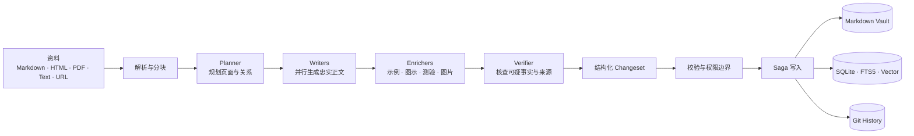
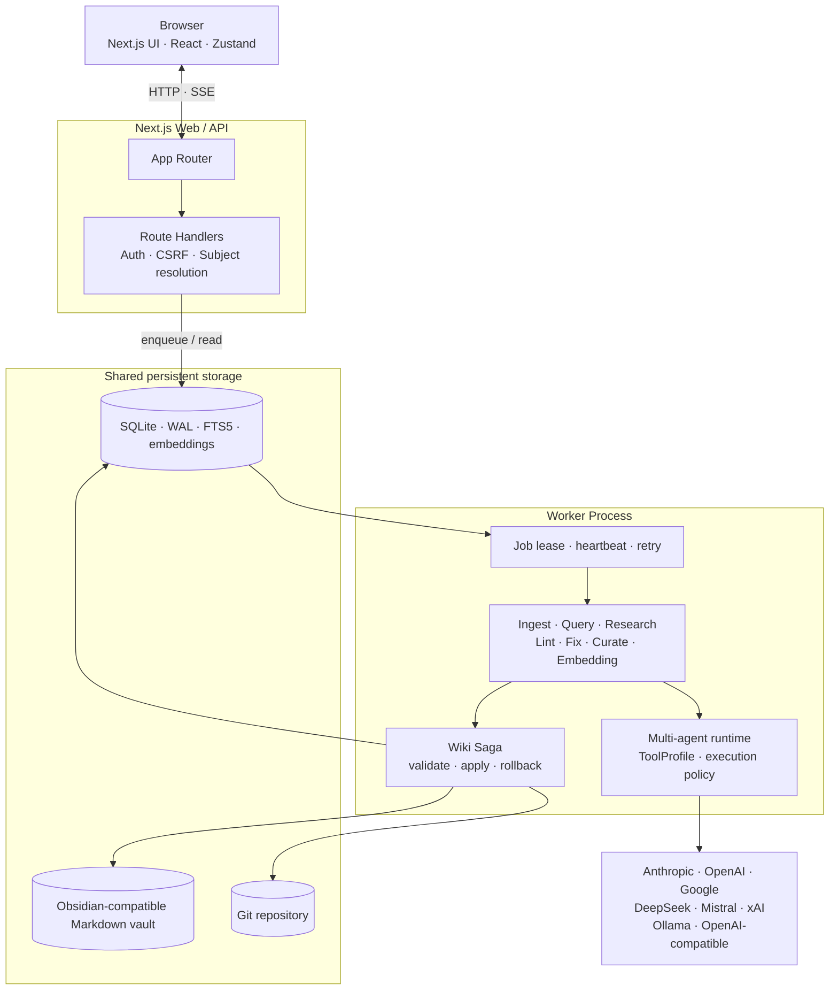

<div align="center">
  <picture>
    <source media="(prefers-color-scheme: dark)" srcset="docs/brand/weftwise-mark-dark.svg">
    <source media="(prefers-color-scheme: light)" srcset="docs/brand/weftwise-mark.svg">
    
  </picture>

  # weftwise 织识

  **Knowledge, woven. —— 让读过的一切，织成一张布。**

  一个由 AI 持续构建、校验和维护的本地优先个人知识库。
  将 Markdown、HTML、PDF、纯文本与网页资料，编织成可追溯、可搜索、彼此链接的 Wiki。
</div>

---

## 为什么是 weftwise

传统笔记工具把整理工作留给人，普通 AI 问答又往往在会话结束后失去上下文。weftwise 把两者之间缺失的那一层补了起来：它不只回答问题，而是让一组受约束的 AI agent 将资料转化为长期存在的知识网络。

- **从资料到知识网络**：解析来源、规划主题、分工写作、内容增益、事实核查，再生成带 wikilink 的页面。
- **本地优先且可恢复**：Markdown 正文存放在本地 vault，SQLite 只是可重建索引，所有内容变更都有 git 历史。
- **不让模型直接写盘**：模型只生成结构化结果，真正写入统一经过校验、权限策略和 Saga 事务。
- **持续维护而非一次生成**：Health、Fix、Curate、Research、重塑视角与历史回滚共同维护知识库质量。
- **面向多个知识领域**：每个 Subject 都是独立工作区，同名页面互不污染，也能显式跨主题引用。

## 核心体验

| 能力 | 你可以做什么 |
|------|--------------|
| **Ingest** | 导入 Markdown、HTML、PDF、纯文本、URL 或多份资料；大文件自动分块，多 agent 并行生成页面 |
| **Read & Navigate** | 在三联布局中阅读 Wiki，使用目录、反向链接、标签、全文搜索、语义搜索与知识图谱探索内容 |
| **Ask AI** | 基于当前 Subject 和页面上下文问答；引用 Wiki 证据，并将写操作转成可审阅的 PendingAction |
| **Research** | 从健康检查发现知识缺口，联网检索候选资料，人工批准后再进入 Ingest 流水线 |
| **Health & Fix** | 发现断链、孤立来源、内容矛盾等问题；按精确工具权限修复并再次验证 |
| **Curate** | 整理标签与链接，辅助合并、拆分、移动和重命名页面，保持知识结构清晰 |
| **Reshape** | 用指定视角重塑整页或局部内容，保留原始页面并持久化不同 rendition |
| **History** | 查看每次变更的页面级 diff，通过审批流程回滚历史操作 |

## 从一份资料到一张知识网



流水线中的 agent 只能读取 Wiki 或生成结构化输出，不能任意修改文件。写入在 service 层统一收口，按 `validate → fs → SQLite transaction → git commit` 执行；任一步失败都会进入补偿流程。

## 架构

weftwise 将短生命周期的 Web/API 与长时间运行的 AI 任务拆成两个进程。Web 进程负责页面、读取和入队；Worker 从 SQLite 领取带租约的任务，执行 LLM 工作流，并在 vault 锁保护下提交变更。



### 几条不能绕过的不变量

1. **Vault 是内容真源**：Wiki 页面和来源 sidecar 都持久化到 vault；数据库损坏时可以重建。
2. **所有 Wiki 写入走 Saga**：文件系统、SQLite 和 git 无法组成真正的 ACID，因此使用可补偿事务保持最终一致。
3. **模型输出必须结构化**：LLM 经 AI SDK 与 Zod schema 产出对象，不直接生成或覆盖 Markdown 文件。
4. **工具权限按运行上下文收缩**：Query 只能读取或提案；Fix、Curate 等写工具还需要匹配的 profile、页面范围和 job capability。
5. **Subject 贯穿全链路**：API、任务、检索、页面身份、文件路径和提交记录都携带 Subject，跨主题链接必须显式声明。

更深入的代码导览见 [`docs/TOUR.md`](./docs/TOUR.md)，完整架构导航见 [`CLAUDE.md`](./CLAUDE.md)。

## 快速开始

### 环境要求

- Node.js 20+
- npm
- git
- 至少一个 LLM provider 的 API key，或可访问的 Ollama / OpenAI-compatible 服务

### 本地运行

```bash
# 1. 安装依赖
npm install

# 2. 创建本地配置
cp .env.example .env.local
cp llm-config.example.json llm-config.json

# 3. 在 .env.local 中填写 API key，
#    并按需修改 llm-config.json 的 provider / model / task 路由

# 4. 初始化数据库
npm run db:migrate

# 5. 同时启动 Web 与 Worker
npm run dev:all
```

打开 [http://localhost:3000](http://localhost:3000)。首次进入后可以新建 Subject，再通过 **New Ingest** 导入第一份资料。

> 只运行 `npm run dev` 会启动 Web 进程，但 Ingest、Research、Fix 等后台任务不会被消费。日常开发建议始终使用 `npm run dev:all`。

### Docker Compose

```bash
cp .env.example .env
cp llm-config.example.json llm-config.json

# 编辑 .env 与 llm-config.json 后构建并启动
docker compose up --build
```

服务监听 `http://localhost:3000`。vault 挂载到 `./data/vault`，SQLite 数据保存在 Docker volume `wiki-db`。

## 配置 LLM

密钥只放在 `.env.local`（Docker 使用 `.env`）；模型、参数与任务路由统一放在不会提交的 `llm-config.json`。

```jsonc
{
  "defaults": {
    "profile": "anthropic-default",
    "model": "claude-sonnet-4-6",
    "maxTokens": 4096
  },
  "tasks": {
    "query": {
      "profile": "anthropic-default",
      "model": "claude-sonnet-4-6"
    },
    "embedding": {
      "profile": "openai-default",
      "model": "text-embedding-3-small"
    }
  },
  "providers": {
    "anthropic-default": {
      "provider": "anthropic",
      "apiKeyEnv": "ANTHROPIC_API_KEY"
    },
    "openai-default": {
      "provider": "openai",
      "apiKeyEnv": "OPENAI_API_KEY"
    }
  }
}
```

路由合并顺序为 `defaults < task < 调用点 override`。完整示例见 [`llm-config.example.json`](./llm-config.example.json)，字段约束见 [`llm-config.schema.json`](./llm-config.schema.json)。Embedding 未配置时，语义检索会安全降级为 FTS 全文检索。

联网 Research 与事实核查使用独立的 Web Search 设置，可在应用内 **Settings → Web Search** 配置，不需要写入 Zustand 或重启 Worker。

## 数据目录

```text
data/
├── vault/                         # Git 仓库；Wiki 内容的持久化真源
│   ├── wiki/<subject>/*.md        # Obsidian-compatible Wiki 页面
│   ├── raw/<subject>/...          # 导入的原始资料
│   └── .llm-wiki/
│       ├── sources/<subject>/*.json
│       └── skills/*.md
├── wiki.db                        # SQLite 索引、任务、事件与应用状态
├── .source-auth-key               # URL 登录态临时 grant 主密钥（0600）
└── source-auth/                   # 任务级 AES-GCM 临时密文（成功/过期清理）
```

需要登录的 URL 只把短期 Cookie/Authorization 加密保存在数据库同目录；这些凭证不会进入
vault/Git 或明文 SQLite，也不会自动复用于其他来源。

默认路径可以通过环境变量覆盖：

```bash
VAULT_PATH=./data/vault
DATABASE_PATH=./data/wiki.db
WIKI_API_KEY=                      # 可选；设置后写接口需要认证
WORKER_POLL_INTERVAL_MS=2000
```

## 常用命令

| 命令 | 说明 |
|------|------|
| `npm run dev:all` | 同时启动 Next.js 与 Worker |
| `npm run build` | 构建生产版本并执行 Next.js 类型检查 |
| `npm run start:all` | 同时启动已构建的 Web 与 Worker |
| `npm test` | 运行 Vitest 全量测试 |
| `npm run lint` | 运行 ESLint |
| `npm run db:generate` | 根据 Drizzle schema 生成迁移 |
| `npm run db:migrate` | 应用数据库迁移 |
| `npm run db:rebuild` | 从 vault 全量重建 SQLite 缓存 |
| `npm run db:migrate-subjects` | 将旧版单主题数据迁移到 Subject 架构 |
| `npm run eval:retrieval` | 对 FTS、向量和混合检索运行基准评估 |

## 技术栈

| 层次 | 技术 |
|------|------|
| Web | Next.js 15 · React 19 · TypeScript 5 |
| UI | Tailwind CSS · Zustand · TanStack React Query · Lucide · Cytoscape |
| AI | Vercel AI SDK · Zod structured output · 多供应商 task router |
| 内容 | unified / remark / rehype · Shiki · KaTeX · Mermaid · Obsidian wikilink |
| 数据 | SQLite · better-sqlite3 · Drizzle ORM · FTS5 · 向量余弦检索 |
| 可靠性 | 持久化 Job Queue · Lease / Heartbeat · Saga · Git |

## 项目结构

```text
src/
├── app/             # Next.js 页面与 API Route Handlers
├── components/      # 布局、阅读器、Ask AI、Health、Graph 与设计系统
├── hooks/           # SSE、搜索、Subject、Lens 等客户端 hooks
├── lib/             # 领域 contracts 与前后端共享纯函数
├── server/
│   ├── agents/      # Multi-agent runtime、skills、tools 与权限策略
│   ├── db/          # Drizzle schema、SQLite client 与 repositories
│   ├── jobs/        # 持久化队列、worker、租约、心跳与 SSE events
│   ├── llm/         # Provider registry、task router 与 prompts
│   ├── search/      # FTS、向量检索与 RRF 混合排序
│   ├── services/    # Ingest、Query、Research、Lint、Fix、Curate 等编排
│   ├── sources/     # 文件解析、URL 抓取与来源持久化
│   └── wiki/        # 页面身份、wikilink、changeset、Saga 与回滚
└── stores/          # Zustand 客户端 UI 状态
```

各模块的边界和开发约定记录在对应目录的 `CLAUDE.md` 中：

- [`src/app/CLAUDE.md`](./src/app/CLAUDE.md)
- [`src/components/CLAUDE.md`](./src/components/CLAUDE.md)
- [`src/server/CLAUDE.md`](./src/server/CLAUDE.md)
- [`src/server/agents/CLAUDE.md`](./src/server/agents/CLAUDE.md)
- [`src/server/db/CLAUDE.md`](./src/server/db/CLAUDE.md)
- [`src/server/jobs/CLAUDE.md`](./src/server/jobs/CLAUDE.md)
- [`src/server/llm/CLAUDE.md`](./src/server/llm/CLAUDE.md)
- [`src/server/wiki/CLAUDE.md`](./src/server/wiki/CLAUDE.md)

## 开发约定

- 领域类型集中在 `src/lib/contracts.ts`，避免跨层重复定义。
- 新增写接口必须经过认证、CSRF 与 Subject 解析；长任务只入队，不在 Route Handler 内执行。
- 新增 LLM 任务需要同步更新 task schema、示例配置与 prompt，并使用结构化输出。
- 修改检索算法或参数时，必须附带 `npm run eval:retrieval` 的前后指标。
- 修复缺陷先写失败测试；完成前至少运行相关测试、类型检查和 `git diff --check`。

欢迎从 [`docs/TOUR.md`](./docs/TOUR.md) 开始阅读代码。品牌资产与使用规范位于 [`docs/brand/`](./docs/brand/README.md)。
