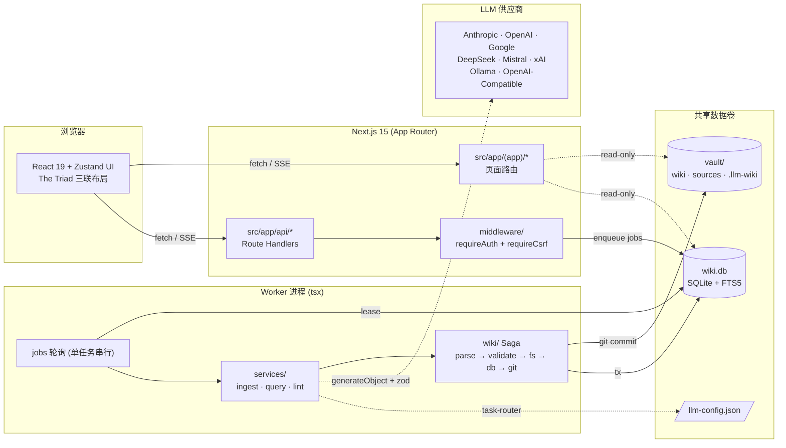
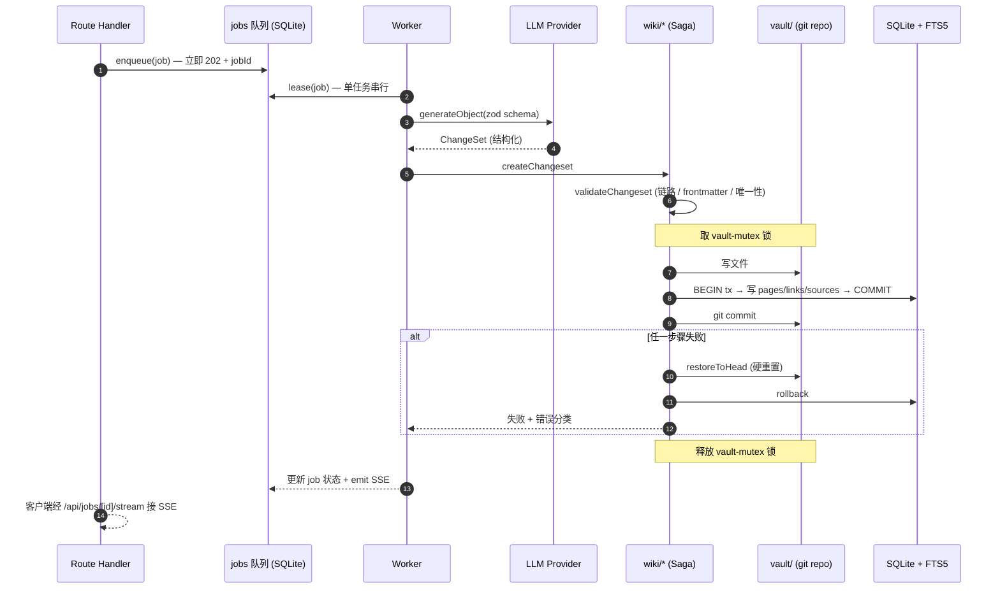

# Agentic Wiki

> 个人知识管理 Web 应用：由 LLM 从原始资料（Markdown / HTML / PDF / 纯文本）增量构建并维护一个可持久化、相互交叉引用的 Obsidian 兼容 Wiki。

详细的模块说明请见 [`CLAUDE.md`](./CLAUDE.md) 与各子模块的 `CLAUDE.md`。

---

## 一、进程与数据卷架构

Web 进程只负责读与入队，写操作集中在独立的 worker 进程里串行执行，二者通过共享的 vault（git 仓库）+ SQLite（含 FTS5）通信。



---

## 二、模块结构

源代码全部位于 `src/`，按"前端 UI / 后端 server-only / 共享工具"分层。Server 子模块彼此通过 contracts 与 repos 解耦。

```mermaid
graph TD
    Root["agentic-wiki/"] --> App["src/app<br/>Next.js App Router"]
    Root --> Server["src/server<br/>server-only 业务"]
    Root --> Components["src/components<br/>React UI"]
    Root --> Lib["src/lib<br/>共享工具 + contracts"]
    Root --> Hooks["src/hooks<br/>客户端 hooks"]
    Root --> Stores["src/stores<br/>Zustand UI 状态"]

    App --> AppRoutes["(app)/<br/>wiki · subjects · notebooks"]
    App --> AppApi["api/<br/>ingest · query · lint · search<br/>pages · jobs · graph · agents<br/>notebooks · subjects · session · reset"]

    Server --> SrvDb["db/<br/>Drizzle schema + repos<br/>FTS5 + WAL"]
    Server --> SrvWiki["wiki/<br/>Saga 事务核心<br/>wikilinks · frontmatter · slug"]
    Server --> SrvJobs["jobs/<br/>队列 + worker + SSE"]
    Server --> SrvLlm["llm/<br/>多供应商路由<br/>task-router + prompts"]
    Server --> SrvSvc["services/<br/>ingest · query · lint"]
    Server --> SrvSrc["sources/<br/>md · html · pdf 解析"]
    Server --> SrvAgents["agents/<br/>内置 agent 定义"]
    Server --> SrvGit["git/<br/>simple-git 封装"]
    Server --> SrvNb["notebooks/<br/>笔记本服务"]
    Server --> SrvMw["middleware/<br/>auth + csrf"]
    Server --> SrvCfg["config/<br/>env (zod) + 路径"]

    Components --> CompLayout["layout/<br/>Shell · Sidebar · ContextPanel"]
    Components --> CompUi["ui/<br/>设计系统原语"]
    Components --> CompWiki["wiki/<br/>Markdown 渲染"]
    Components --> CompChat["chat/<br/>对话 UI"]
    Components --> CompSearch["search/<br/>命令面板"]
    Components --> CompGraph["graph/<br/>cytoscape 可视化"]
    Components --> CompShared["shared/"]

    Lib --> LibContracts["contracts.ts<br/>所有 domain 类型"]
    Lib --> LibTheme["theme/"]
    Lib --> LibUtil["cn · slug · api-fetch · markdown-client"]
```



---

## 三、Saga 写入事务

任何"修改 vault"的操作（ingest / lint 修复 / 用户手动编辑）都走同一条 Saga，确保 fs + SQLite + git 三方最终一致。



---

## 四、目录速览

| 路径 | 一句话职责 |
|------|-----------|
| `src/app/` | App Router 页面（`(app)/wiki · subjects · notebooks`）+ `api/*` Route Handlers |
| `src/server/wiki/` | Saga 事务：`createChangeset` / `validateChangeset` / `applyChangeset` / `rollbackChangeset` + `wikilinks` |
| `src/server/db/` | Drizzle schema、SQLite 单例、`pages` / `jobs` / `sources` repos + FTS5 |
| `src/server/jobs/` | SQLite 持久化任务队列、worker 轮询、SSE 事件发射 |
| `src/server/llm/` | 多供应商路由、task-router（defaults < task < override）、`prompts/` |
| `src/server/services/` | `ingest-service` / `query-service` / `lint-service` 任务处理器 |
| `src/server/sources/` | 原始资料解析器（md / html / pdf）+ source-store |
| `src/server/agents/` | 内置 agent 定义与运行时 |
| `src/server/git/` | vault 仓库初始化、commit、`restoreToHead`（用于 Saga 回滚） |
| `src/server/middleware/` | `requireAuth`（Bearer / cookie / query）+ `requireCsrf`（Origin 校验） |
| `src/server/config/` | env schema（zod）+ `vaultPath()` |
| `src/components/` | 布局 / 设计系统原语 / wiki 渲染 / chat / search / graph |
| `src/lib/` | `contracts.ts`（domain 类型集中点）+ 通用工具 |
| `src/stores/` | Zustand 客户端 UI 状态（侧边栏、上下文面板、暗黑模式） |
| `data/` | 默认 vault 与 SQLite 数据卷（`VAULT_PATH` / `DATABASE_PATH` 可覆盖） |
| `scripts/` | 一次性维护脚本 |

---

## 五、快速开始

```bash
# 1. 安装依赖
npm install

# 2. 配置环境
cp .env.example .env.local
cp llm-config.example.json llm-config.json   # 填入至少一个供应商 API key

# 3. 初始化数据库
npm run db:migrate

# 4. 同时启动 Next.js + Worker（推荐开发使用）
npm run dev:all
```

| 命令 | 说明 |
|------|------|
| `npm run dev` | 仅 Next.js 开发服务器 |
| `npm run dev:all` | Next.js + worker 并发（写操作必须） |
| `npm run build` / `npm run start:all` | 生产构建与启动 |
| `npm run db:generate` / `npm run db:migrate` | drizzle-kit 生成 / 应用迁移 |
| `npm run lint` | ESLint |

主要环境变量：

```bash
VAULT_PATH=./data/vault          # vault 目录（含 git 仓库）
DATABASE_PATH=./data/wiki.db     # SQLite 数据库文件
WIKI_API_KEY=<可选>              # 不设置 = 本地放行；设置 = 需要 Bearer / cookie 鉴权
WORKER_POLL_INTERVAL_MS=2000     # worker 轮询间隔（默认 2s）
```

---

## 六、技术栈

| 分类 | 选型 |
|------|------|
| 框架 | Next.js 15（App Router）+ React 19 + TypeScript 5 |
| 样式 | Tailwind CSS 3.4 + class-variance-authority + 自定义 CSS 变量主题 |
| 状态 | Zustand（客户端）+ TanStack React Query |
| 数据库 | better-sqlite3 11 + Drizzle ORM 0.38 + FTS5 |
| LLM | Vercel AI SDK 4 + Anthropic / OpenAI / Google / DeepSeek / Mistral / xAI / Ollama / OpenAI-Compatible |
| Markdown | unified / remark / rehype + gray-matter + rehype-pretty-code（Shiki）+ @uiw/react-md-editor |
| 其它 | simple-git（vault commit）· pdf-parse · turndown（HTML → MD）· cytoscape（图）· zod |

---

## 七、关键架构决策

| 决策 | 选择 | 理由 |
|------|------|------|
| 长任务执行 | 独立 worker 进程（`src/server/worker-entry.ts`） | Route Handler 生命周期不可靠 |
| Wiki 写入 | Saga：内存 changeset → validate → fs → SQLite tx → git commit | fs + SQLite + git 无法组成真 ACID |
| LLM 产出 | `generateObject()` + Zod schema | 防止跨供应商格式漂移 |
| Wikilink 解析 | 唯一真实源 `src/server/wiki/wikilinks.ts` | 避免多份实现语义漂移 |
| 并发控制 | `vault-mutex` + worker 单任务串行 + SQLite WAL | 并行 git 提交会损坏 vault |
| 源数据 | `vault/.llm-wiki/sources/*.json` 同时落地 | SQLite 仅作为可重建缓存 |
